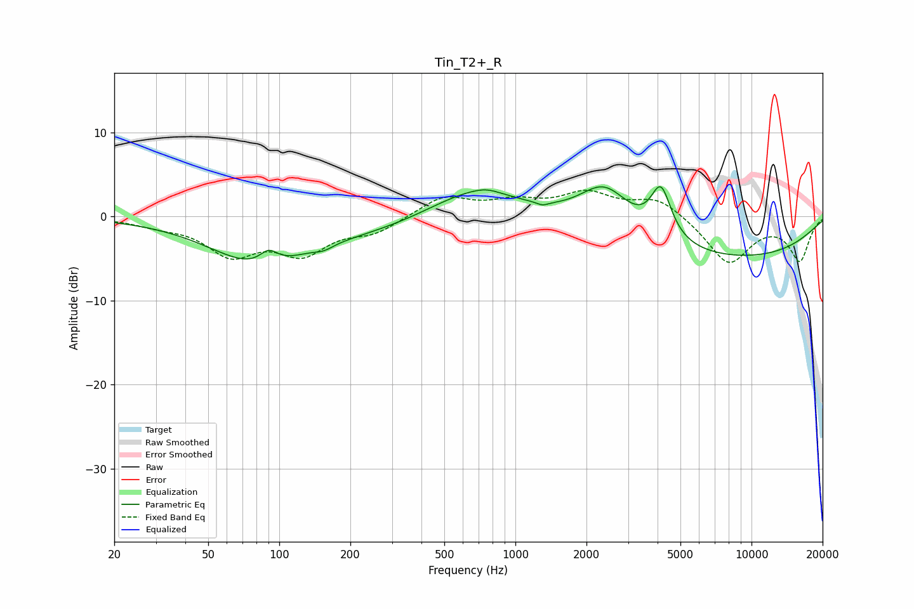

# Tin_T2+_R
See [usage instructions](https://github.com/jaakkopasanen/AutoEq#usage) for more options and info.

### Parametric EQs
Apply preamp of -3.6 dB when using parametric equalizer.

|   # | Type    |   Fc (Hz) |    Q |   Gain (dB) |
|-----|---------|-----------|------|-------------|
|   1 | Peaking |        82 | 0.68 |        -5.3 |
|   2 | Peaking |        90 | 3.71 |         1.7 |
|   3 | Peaking |       154 | 3.73 |        -0.5 |
|   4 | Peaking |       264 | 0.46 |        -1.6 |
|   5 | Peaking |       660 | 0.72 |         3.8 |
|   6 | Peaking |       754 | 2.58 |         0.4 |
|   7 | Peaking |      1302 | 5.96 |        -0.4 |
|   8 | Peaking |      2386 | 1.3  |         5.3 |
|   9 | Peaking |      4135 | 3.24 |         6   |
|  10 | Peaking |      7837 | 0.28 |        -5   |

### Fixed Band EQs
When using fixed band (also called graphic) equalizer, apply preamp of **-3.2 dB** (if available) and set gains manually with these parameters.

|   # | Type    |   Fc (Hz) |    Q |   Gain (dB) |
|-----|---------|-----------|------|-------------|
|   1 | Peaking |        31 | 1.41 |        -0.8 |
|   2 | Peaking |        62 | 1.41 |        -4.1 |
|   3 | Peaking |       125 | 1.41 |        -4   |
|   4 | Peaking |       250 | 1.41 |        -1.7 |
|   5 | Peaking |       500 | 1.41 |         2.4 |
|   6 | Peaking |      1000 | 1.41 |         1.5 |
|   7 | Peaking |      2000 | 1.41 |         2.6 |
|   8 | Peaking |      4000 | 1.41 |         2.2 |
|   9 | Peaking |      8000 | 1.41 |        -5.6 |
|  10 | Peaking |     16000 | 1.41 |        -5.1 |

### Graphs

