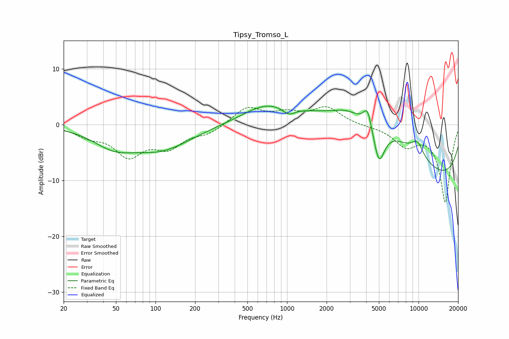

# Tipsy_Tromso_L
See [usage instructions](https://github.com/jaakkopasanen/AutoEq#usage) for more options and info.

### Parametric EQs
Apply preamp of -3.4 dB when using parametric equalizer.

|   # | Type    |   Fc (Hz) |    Q |   Gain (dB) |
|-----|---------|-----------|------|-------------|
|   1 | Peaking |        48 | 0.91 |        -3   |
|   2 | Peaking |       110 | 0.61 |        -4.2 |
|   3 | Peaking |       698 | 0.76 |         3.1 |
|   4 | Peaking |      1031 | 2.96 |        -1.4 |
|   5 | Peaking |      2772 | 1.91 |         0.6 |
|   6 | Peaking |      4096 | 4.79 |         3.4 |
|   7 | Peaking |      4609 | 0.34 |        11   |
|   8 | Peaking |      5006 | 3.12 |        -7   |
|   9 | Peaking |      9809 | 2.63 |         2.6 |
|  10 | Peaking |     10000 | 0.2  |       -12.7 |

### Fixed Band EQs
When using fixed band (also called graphic) equalizer, apply preamp of **-3.3 dB** (if available) and set gains manually with these parameters.

|   # | Type    |   Fc (Hz) |    Q |   Gain (dB) |
|-----|---------|-----------|------|-------------|
|   1 | Peaking |        31 | 1.41 |        -1.7 |
|   2 | Peaking |        62 | 1.41 |        -5.2 |
|   3 | Peaking |       125 | 1.41 |        -3.6 |
|   4 | Peaking |       250 | 1.41 |        -1.4 |
|   5 | Peaking |       500 | 1.41 |         3.1 |
|   6 | Peaking |      1000 | 1.41 |         1.7 |
|   7 | Peaking |      2000 | 1.41 |         3   |
|   8 | Peaking |      4000 | 1.41 |        -0.2 |
|   9 | Peaking |      8000 | 1.41 |        -3.4 |
|  10 | Peaking |     16000 | 1.41 |       -13.8 |

### Graphs

