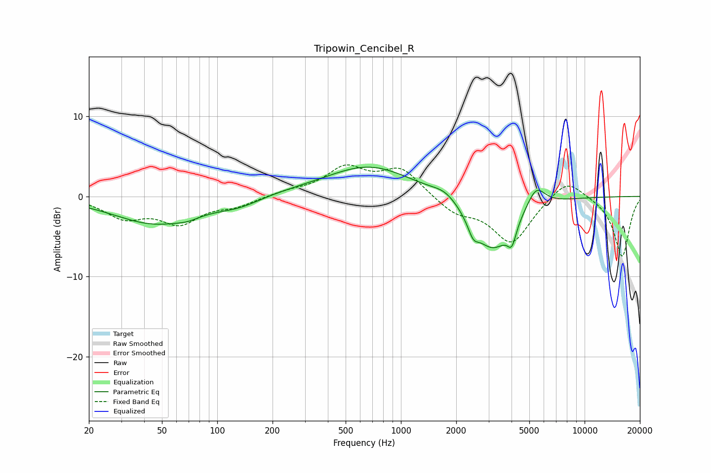

# Tripowin_Cencibel_R
See [usage instructions](https://github.com/jaakkopasanen/AutoEq#usage) for more options and info.

### Parametric EQs
Apply preamp of -3.7 dB when using parametric equalizer.

|   # | Type    |   Fc (Hz) |    Q |   Gain (dB) |
|-----|---------|-----------|------|-------------|
|   1 | Peaking |        46 | 0.62 |        -3.4 |
|   2 | Peaking |        69 | 2.29 |        -0.4 |
|   3 | Peaking |       132 | 1.11 |        -1.1 |
|   4 | Peaking |       189 | 0.53 |         0.4 |
|   5 | Peaking |       678 | 0.6  |         3.8 |
|   6 | Peaking |      1754 | 1.99 |         1.1 |
|   7 | Peaking |      2475 | 5.04 |        -1.7 |
|   8 | Peaking |      3150 | 1.23 |        -6.8 |
|   9 | Peaking |      4016 | 6    |        -2.4 |
|  10 | Peaking |      5439 | 2.78 |         2.8 |

### Fixed Band EQs
When using fixed band (also called graphic) equalizer, apply preamp of **-4.0 dB** (if available) and set gains manually with these parameters.

|   # | Type    |   Fc (Hz) |    Q |   Gain (dB) |
|-----|---------|-----------|------|-------------|
|   1 | Peaking |        31 | 1.41 |        -2.4 |
|   2 | Peaking |        62 | 1.41 |        -3.1 |
|   3 | Peaking |       125 | 1.41 |        -1   |
|   4 | Peaking |       250 | 1.41 |         0.5 |
|   5 | Peaking |       500 | 1.41 |         3.4 |
|   6 | Peaking |      1000 | 1.41 |         3.3 |
|   7 | Peaking |      2000 | 1.41 |        -1.9 |
|   8 | Peaking |      4000 | 1.41 |        -5.8 |
|   9 | Peaking |      8000 | 1.41 |         2.6 |
|  10 | Peaking |     16000 | 1.41 |        -7.5 |

### Graphs

