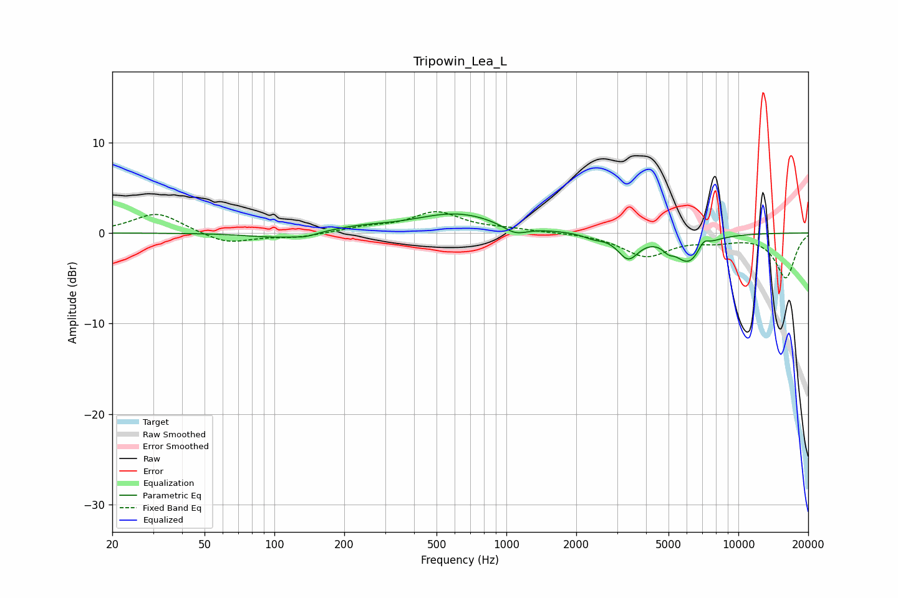

# Tripowin_Lea_L
See [usage instructions](https://github.com/jaakkopasanen/AutoEq#usage) for more options and info.

### Parametric EQs
Apply preamp of -2.2 dB when using parametric equalizer.

|   # | Type    |   Fc (Hz) |    Q |   Gain (dB) |
|-----|---------|-----------|------|-------------|
|   1 | Peaking |       103 | 1.09 |        -0.6 |
|   2 | Peaking |       136 | 3.18 |        -0.3 |
|   3 | Peaking |       232 | 1.12 |         0.5 |
|   4 | Peaking |       613 | 0.77 |         2.1 |
|   5 | Peaking |      1091 | 2.67 |        -1   |
|   6 | Peaking |      2371 | 3.38 |        -0.4 |
|   7 | Peaking |      3353 | 3.13 |        -2.6 |
|   8 | Peaking |      4989 | 5.94 |        -0.7 |
|   9 | Peaking |      6103 | 2.28 |        -3.1 |
|  10 | Peaking |      7074 | 6    |         1   |

### Fixed Band EQs
When using fixed band (also called graphic) equalizer, apply preamp of **-2.4 dB** (if available) and set gains manually with these parameters.

|   # | Type    |   Fc (Hz) |    Q |   Gain (dB) |
|-----|---------|-----------|------|-------------|
|   1 | Peaking |        31 | 1.41 |         2.3 |
|   2 | Peaking |        62 | 1.41 |        -1.2 |
|   3 | Peaking |       125 | 1.41 |        -0.5 |
|   4 | Peaking |       250 | 1.41 |         0.5 |
|   5 | Peaking |       500 | 1.41 |         2.2 |
|   6 | Peaking |      1000 | 1.41 |         0.3 |
|   7 | Peaking |      2000 | 1.41 |         0   |
|   8 | Peaking |      4000 | 1.41 |        -2.5 |
|   9 | Peaking |      8000 | 1.41 |        -0.7 |
|  10 | Peaking |     16000 | 1.41 |        -4.9 |

### Graphs

