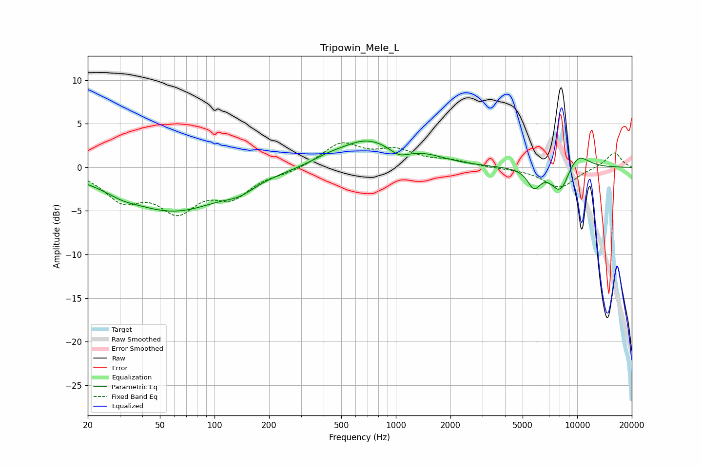

# Tripowin_Mele_L
See [usage instructions](https://github.com/jaakkopasanen/AutoEq#usage) for more options and info.

### Parametric EQs
Apply preamp of -3.1 dB when using parametric equalizer.

|   # | Type    |   Fc (Hz) |    Q |   Gain (dB) |
|-----|---------|-----------|------|-------------|
|   1 | Peaking |        31 | 1.83 |        -0.5 |
|   2 | Peaking |        59 | 0.5  |        -4.9 |
|   3 | Peaking |       138 | 1.75 |        -0.9 |
|   4 | Peaking |       415 | 1.61 |         0.5 |
|   5 | Peaking |       695 | 0.9  |         3.1 |
|   6 | Peaking |      1039 | 2.69 |        -0.9 |
|   7 | Peaking |      1478 | 1.21 |         0.8 |
|   8 | Peaking |      5779 | 3.81 |        -2.1 |
|   9 | Peaking |      8071 | 2.49 |        -3.2 |
|  10 | Peaking |     10000 | 1.86 |         2   |

### Fixed Band EQs
When using fixed band (also called graphic) equalizer, apply preamp of **-2.9 dB** (if available) and set gains manually with these parameters.

|   # | Type    |   Fc (Hz) |    Q |   Gain (dB) |
|-----|---------|-----------|------|-------------|
|   1 | Peaking |        31 | 1.41 |        -3.3 |
|   2 | Peaking |        62 | 1.41 |        -4.4 |
|   3 | Peaking |       125 | 1.41 |        -2.9 |
|   4 | Peaking |       250 | 1.41 |        -0.5 |
|   5 | Peaking |       500 | 1.41 |         2.7 |
|   6 | Peaking |      1000 | 1.41 |         1.7 |
|   7 | Peaking |      2000 | 1.41 |         0.6 |
|   8 | Peaking |      4000 | 1.41 |        -0.1 |
|   9 | Peaking |      8000 | 1.41 |        -2.4 |
|  10 | Peaking |     16000 | 1.41 |         1.8 |

### Graphs

