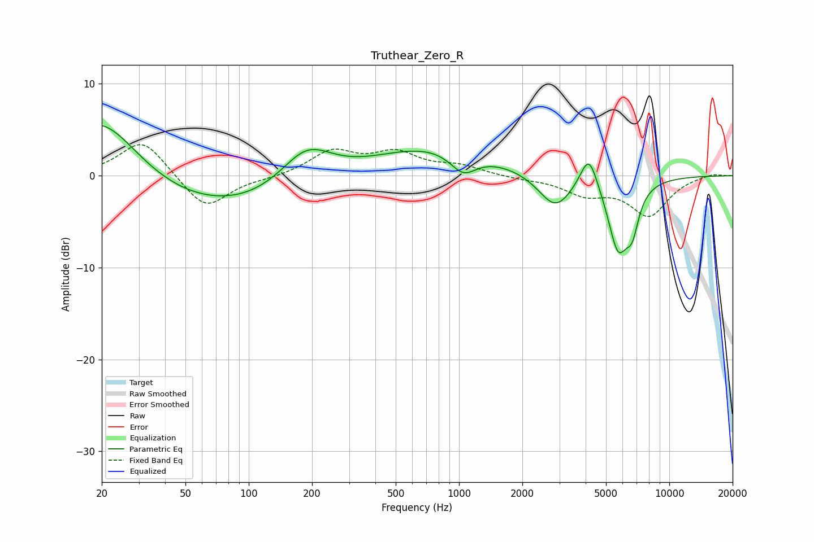

# Truthear_Zero_R
See [usage instructions](https://github.com/jaakkopasanen/AutoEq#usage) for more options and info.

### Parametric EQs
Apply preamp of -5.6 dB when using parametric equalizer.

|   # | Type    |   Fc (Hz) |    Q |   Gain (dB) |
|-----|---------|-----------|------|-------------|
|   1 | Peaking |        20 | 0.73 |         8.2 |
|   2 | Peaking |        62 | 0.26 |        -4.3 |
|   3 | Peaking |       188 | 1.1  |         4.6 |
|   4 | Peaking |       745 | 0.47 |         3.3 |
|   5 | Peaking |      1048 | 2.21 |        -2.4 |
|   6 | Peaking |      2868 | 1.75 |        -3.8 |
|   7 | Peaking |      4143 | 3.4  |         3.9 |
|   8 | Peaking |      4831 | 2.32 |         0.2 |
|   9 | Peaking |      5711 | 2.71 |        -7.7 |
|  10 | Peaking |      6668 | 4.42 |        -3.5 |

### Fixed Band EQs
When using fixed band (also called graphic) equalizer, apply preamp of **-3.5 dB** (if available) and set gains manually with these parameters.

|   # | Type    |   Fc (Hz) |    Q |   Gain (dB) |
|-----|---------|-----------|------|-------------|
|   1 | Peaking |        31 | 1.41 |         4   |
|   2 | Peaking |        62 | 1.41 |        -3.8 |
|   3 | Peaking |       125 | 1.41 |        -0.2 |
|   4 | Peaking |       250 | 1.41 |         2.6 |
|   5 | Peaking |       500 | 1.41 |         2.3 |
|   6 | Peaking |      1000 | 1.41 |         0.9 |
|   7 | Peaking |      2000 | 1.41 |        -0.3 |
|   8 | Peaking |      4000 | 1.41 |        -1.8 |
|   9 | Peaking |      8000 | 1.41 |        -4.2 |
|  10 | Peaking |     16000 | 1.41 |         0.3 |

### Graphs

