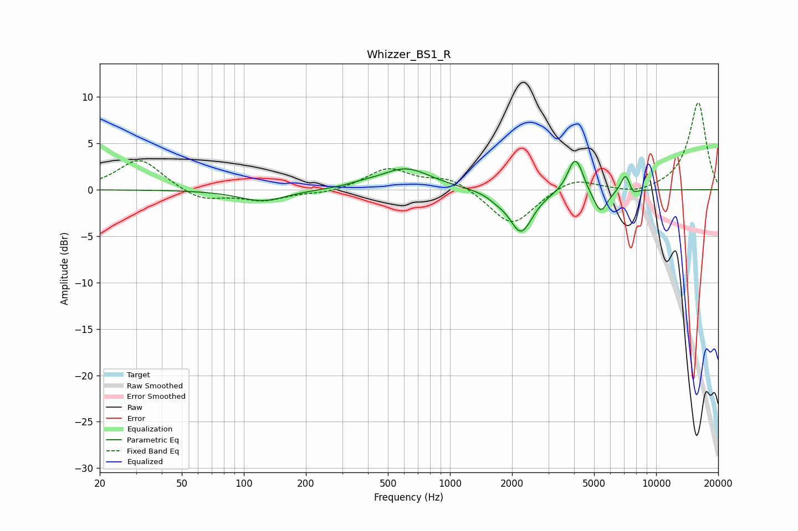

# Whizzer_BS1_R
See [usage instructions](https://github.com/jaakkopasanen/AutoEq#usage) for more options and info.

### Parametric EQs
Apply preamp of -3.2 dB when using parametric equalizer.

|   # | Type    |   Fc (Hz) |    Q |   Gain (dB) |
|-----|---------|-----------|------|-------------|
|   1 | Peaking |       123 | 1.23 |        -1.2 |
|   2 | Peaking |       376 | 2.16 |         0.2 |
|   3 | Peaking |       610 | 1.16 |         2.3 |
|   4 | Peaking |      1683 | 3.4  |        -0.4 |
|   5 | Peaking |      2211 | 2.49 |        -4.6 |
|   6 | Peaking |      4003 | 4.15 |         3.2 |
|   7 | Peaking |      4269 | 6    |         0.8 |
|   8 | Peaking |      5375 | 4.06 |        -2.6 |
|   9 | Peaking |      7120 | 5.98 |         2   |
|  10 | Peaking |      7696 | 6    |        -0.8 |

### Fixed Band EQs
When using fixed band (also called graphic) equalizer, apply preamp of **-9.5 dB** (if available) and set gains manually with these parameters.

|   # | Type    |   Fc (Hz) |    Q |   Gain (dB) |
|-----|---------|-----------|------|-------------|
|   1 | Peaking |        31 | 1.41 |         3.4 |
|   2 | Peaking |        62 | 1.41 |        -1.2 |
|   3 | Peaking |       125 | 1.41 |        -1.1 |
|   4 | Peaking |       250 | 1.41 |        -0.4 |
|   5 | Peaking |       500 | 1.41 |         2.3 |
|   6 | Peaking |      1000 | 1.41 |         1.3 |
|   7 | Peaking |      2000 | 1.41 |        -4   |
|   8 | Peaking |      4000 | 1.41 |         1.4 |
|   9 | Peaking |      8000 | 1.41 |        -0.6 |
|  10 | Peaking |     16000 | 1.41 |         9.5 |

### Graphs

