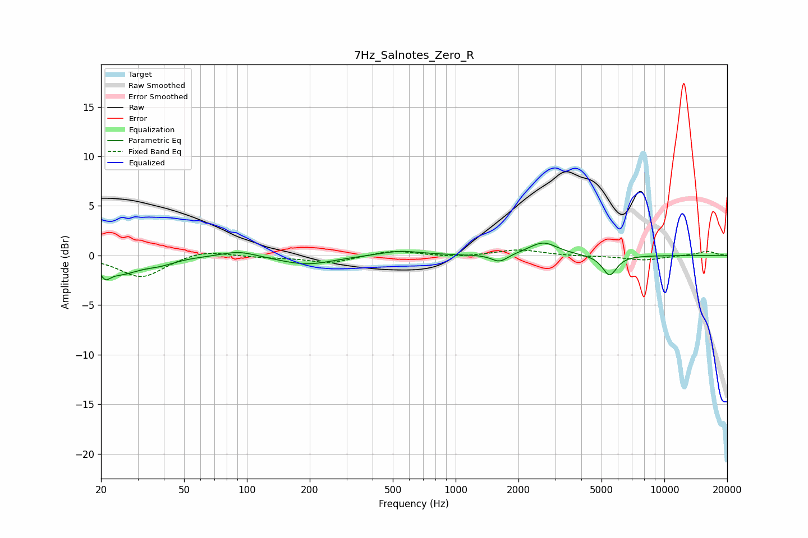

# 7Hz_Salnotes_Zero_R
See [usage instructions](https://github.com/jaakkopasanen/AutoEq#usage) for more options and info.

### Parametric EQs
Apply preamp of -1.3 dB when using parametric equalizer.

|   # | Type    |   Fc (Hz) |    Q |   Gain (dB) |
|-----|---------|-----------|------|-------------|
|   1 | Peaking |        21 | 5.97 |         1.2 |
|   2 | Peaking |        21 | 5.93 |        -2.2 |
|   3 | Peaking |        25 | 1.51 |        -1.6 |
|   4 | Peaking |        38 | 1.87 |        -0.6 |
|   5 | Peaking |        91 | 1.69 |         0.6 |
|   6 | Peaking |       193 | 1.11 |        -0.9 |
|   7 | Peaking |       541 | 1.38 |         0.5 |
|   8 | Peaking |      1626 | 3.68 |        -0.8 |
|   9 | Peaking |      2628 | 2.05 |         1.3 |
|  10 | Peaking |      5466 | 4.06 |        -2   |

### Fixed Band EQs
When using fixed band (also called graphic) equalizer, apply preamp of **-0.7 dB** (if available) and set gains manually with these parameters.

|   # | Type    |   Fc (Hz) |    Q |   Gain (dB) |
|-----|---------|-----------|------|-------------|
|   1 | Peaking |        31 | 1.41 |        -2.2 |
|   2 | Peaking |        62 | 1.41 |         0.6 |
|   3 | Peaking |       125 | 1.41 |        -0.2 |
|   4 | Peaking |       250 | 1.41 |        -0.8 |
|   5 | Peaking |       500 | 1.41 |         0.6 |
|   6 | Peaking |      1000 | 1.41 |        -0.2 |
|   7 | Peaking |      2000 | 1.41 |         0.6 |
|   8 | Peaking |      4000 | 1.41 |        -0.1 |
|   9 | Peaking |      8000 | 1.41 |        -0.5 |
|  10 | Peaking |     16000 | 1.41 |         0.4 |

### Graphs

