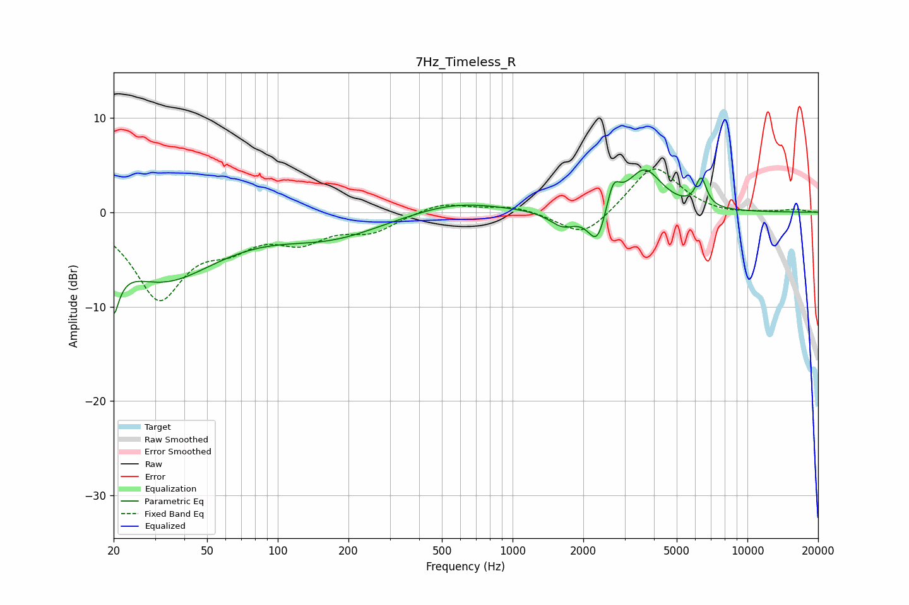

# 7Hz_Timeless_R
See [usage instructions](https://github.com/jaakkopasanen/AutoEq#usage) for more options and info.

### Parametric EQs
Apply preamp of -4.6 dB when using parametric equalizer.

|   # | Type    |   Fc (Hz) |    Q |   Gain (dB) |
|-----|---------|-----------|------|-------------|
|   1 | Peaking |        20 | 5.55 |        -9   |
|   2 | Peaking |        20 | 5.87 |         3.3 |
|   3 | Peaking |        32 | 0.6  |        -7   |
|   4 | Peaking |       168 | 0.63 |        -2.4 |
|   5 | Peaking |       569 | 0.73 |         1.3 |
|   6 | Peaking |      1640 | 2.39 |        -1.7 |
|   7 | Peaking |      2300 | 3.58 |        -4   |
|   8 | Peaking |      2677 | 4.96 |         3   |
|   9 | Peaking |      3641 | 1.89 |         4.5 |
|  10 | Peaking |      6352 | 5.93 |         3   |

### Fixed Band EQs
When using fixed band (also called graphic) equalizer, apply preamp of **-4.7 dB** (if available) and set gains manually with these parameters.

|   # | Type    |   Fc (Hz) |    Q |   Gain (dB) |
|-----|---------|-----------|------|-------------|
|   1 | Peaking |        31 | 1.41 |        -8.8 |
|   2 | Peaking |        62 | 1.41 |        -2.6 |
|   3 | Peaking |       125 | 1.41 |        -2.6 |
|   4 | Peaking |       250 | 1.41 |        -1.8 |
|   5 | Peaking |       500 | 1.41 |         1.1 |
|   6 | Peaking |      1000 | 1.41 |         0.7 |
|   7 | Peaking |      2000 | 1.41 |        -2.8 |
|   8 | Peaking |      4000 | 1.41 |         5.1 |
|   9 | Peaking |      8000 | 1.41 |        -0.3 |
|  10 | Peaking |     16000 | 1.41 |         0.3 |

### Graphs

