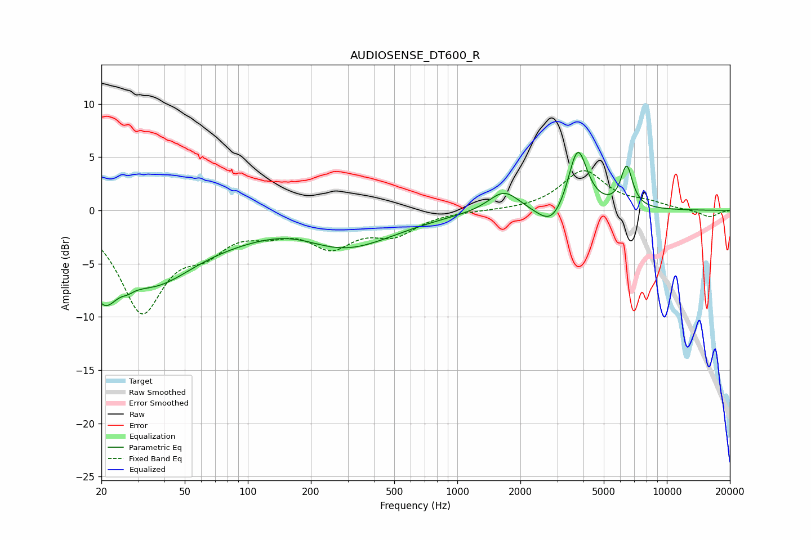

# AUDIOSENSE_DT600_R
See [usage instructions](https://github.com/jaakkopasanen/AutoEq#usage) for more options and info.

### Parametric EQs
Apply preamp of -5.5 dB when using parametric equalizer.

|   # | Type    |   Fc (Hz) |    Q |   Gain (dB) |
|-----|---------|-----------|------|-------------|
|   1 | Peaking |        20 | 2.12 |        -4.8 |
|   2 | Peaking |        27 | 5.2  |        -0.4 |
|   3 | Peaking |        36 | 0.77 |        -4.2 |
|   4 | Peaking |        76 | 0.19 |        -2.5 |
|   5 | Peaking |       170 | 0.72 |         2   |
|   6 | Peaking |       271 | 0.61 |        -2.9 |
|   7 | Peaking |      1671 | 1.91 |         2   |
|   8 | Peaking |      2836 | 2.07 |        -2.1 |
|   9 | Peaking |      3752 | 3.08 |         6.1 |
|  10 | Peaking |      6430 | 4.89 |         3.9 |

### Fixed Band EQs
When using fixed band (also called graphic) equalizer, apply preamp of **-3.8 dB** (if available) and set gains manually with these parameters.

|   # | Type    |   Fc (Hz) |    Q |   Gain (dB) |
|-----|---------|-----------|------|-------------|
|   1 | Peaking |        31 | 1.41 |        -9.1 |
|   2 | Peaking |        62 | 1.41 |        -2.7 |
|   3 | Peaking |       125 | 1.41 |        -1.4 |
|   4 | Peaking |       250 | 1.41 |        -3   |
|   5 | Peaking |       500 | 1.41 |        -2   |
|   6 | Peaking |      1000 | 1.41 |        -0   |
|   7 | Peaking |      2000 | 1.41 |        -0   |
|   8 | Peaking |      4000 | 1.41 |         3.7 |
|   9 | Peaking |      8000 | 1.41 |         0.6 |
|  10 | Peaking |     16000 | 1.41 |        -0.7 |

### Graphs

