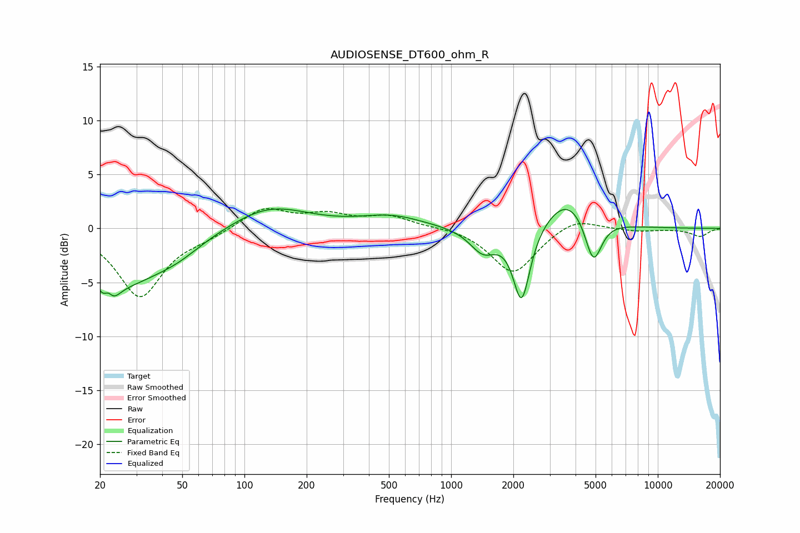

# AUDIOSENSE_DT600_ohm_R
See [usage instructions](https://github.com/jaakkopasanen/AutoEq#usage) for more options and info.

### Parametric EQs
Apply preamp of -1.9 dB when using parametric equalizer.

|   # | Type    |   Fc (Hz) |    Q |   Gain (dB) |
|-----|---------|-----------|------|-------------|
|   1 | Peaking |        22 | 3.86 |        -4.9 |
|   2 | Peaking |        22 | 5.68 |         3.3 |
|   3 | Peaking |        27 | 0.68 |        -4.6 |
|   4 | Peaking |        48 | 1.24 |        -0.9 |
|   5 | Peaking |       131 | 0.76 |         2.2 |
|   6 | Peaking |       515 | 0.93 |         1.1 |
|   7 | Peaking |      1428 | 2.18 |        -2.2 |
|   8 | Peaking |      2193 | 3.42 |        -7   |
|   9 | Peaking |      3681 | 1.25 |         3.1 |
|  10 | Peaking |      4875 | 3.39 |        -4.4 |

### Fixed Band EQs
When using fixed band (also called graphic) equalizer, apply preamp of **-1.9 dB** (if available) and set gains manually with these parameters.

|   # | Type    |   Fc (Hz) |    Q |   Gain (dB) |
|-----|---------|-----------|------|-------------|
|   1 | Peaking |        31 | 1.41 |        -6.3 |
|   2 | Peaking |        62 | 1.41 |        -0.6 |
|   3 | Peaking |       125 | 1.41 |         1.9 |
|   4 | Peaking |       250 | 1.41 |         1.1 |
|   5 | Peaking |       500 | 1.41 |         1.1 |
|   6 | Peaking |      1000 | 1.41 |         0.2 |
|   7 | Peaking |      2000 | 1.41 |        -4.2 |
|   8 | Peaking |      4000 | 1.41 |         1.1 |
|   9 | Peaking |      8000 | 1.41 |        -0.2 |
|  10 | Peaking |     16000 | 1.41 |        -0.7 |

### Graphs

