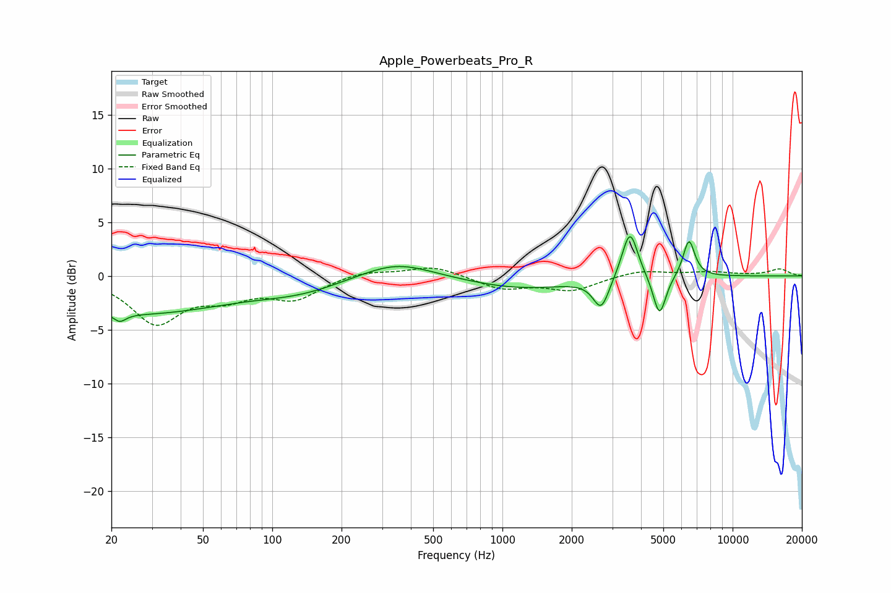

# Apple_Powerbeats_Pro_R
See [usage instructions](https://github.com/jaakkopasanen/AutoEq#usage) for more options and info.

### Parametric EQs
Apply preamp of -3.8 dB when using parametric equalizer.

|   # | Type    |   Fc (Hz) |    Q |   Gain (dB) |
|-----|---------|-----------|------|-------------|
|   1 | Peaking |        22 | 6    |         3.2 |
|   2 | Peaking |        22 | 5.82 |        -4   |
|   3 | Peaking |        25 | 0.34 |        -3.4 |
|   4 | Peaking |       132 | 0.75 |        -1.1 |
|   5 | Peaking |       346 | 0.91 |         1.6 |
|   6 | Peaking |      1208 | 0.6  |        -1.2 |
|   7 | Peaking |      2685 | 4.09 |        -2.8 |
|   8 | Peaking |      3579 | 4.07 |         4.7 |
|   9 | Peaking |      4813 | 5.06 |        -3.9 |
|  10 | Peaking |      6461 | 5.38 |         3.5 |

### Fixed Band EQs
When using fixed band (also called graphic) equalizer, apply preamp of **-0.8 dB** (if available) and set gains manually with these parameters.

|   # | Type    |   Fc (Hz) |    Q |   Gain (dB) |
|-----|---------|-----------|------|-------------|
|   1 | Peaking |        31 | 1.41 |        -4.2 |
|   2 | Peaking |        62 | 1.41 |        -1.7 |
|   3 | Peaking |       125 | 1.41 |        -2   |
|   4 | Peaking |       250 | 1.41 |         0.5 |
|   5 | Peaking |       500 | 1.41 |         1   |
|   6 | Peaking |      1000 | 1.41 |        -1.2 |
|   7 | Peaking |      2000 | 1.41 |        -1.3 |
|   8 | Peaking |      4000 | 1.41 |         0.6 |
|   9 | Peaking |      8000 | 1.41 |         0.3 |
|  10 | Peaking |     16000 | 1.41 |         0.6 |

### Graphs

