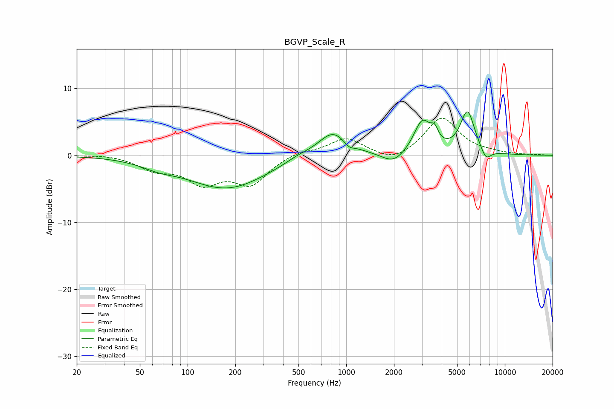

# BGVP_Scale_R
See [usage instructions](https://github.com/jaakkopasanen/AutoEq#usage) for more options and info.

### Parametric EQs
Apply preamp of -6.6 dB when using parametric equalizer.

|   # | Type    |   Fc (Hz) |    Q |   Gain (dB) |
|-----|---------|-----------|------|-------------|
|   1 | Peaking |        65 | 1.34 |        -0.8 |
|   2 | Peaking |       177 | 0.57 |        -4.9 |
|   3 | Peaking |       496 | 1.69 |         0.6 |
|   4 | Peaking |       827 | 1.48 |         3.8 |
|   5 | Peaking |      1039 | 4.12 |        -0.9 |
|   6 | Peaking |      1990 | 1.94 |        -1.7 |
|   7 | Peaking |      3019 | 2.6  |         4.9 |
|   8 | Peaking |      3605 | 6    |         1.7 |
|   9 | Peaking |      5816 | 2.99 |         6.4 |
|  10 | Peaking |      7591 | 4.21 |        -1.7 |

### Fixed Band EQs
When using fixed band (also called graphic) equalizer, apply preamp of **-5.6 dB** (if available) and set gains manually with these parameters.

|   # | Type    |   Fc (Hz) |    Q |   Gain (dB) |
|-----|---------|-----------|------|-------------|
|   1 | Peaking |        31 | 1.41 |         0.2 |
|   2 | Peaking |        62 | 1.41 |        -1.9 |
|   3 | Peaking |       125 | 1.41 |        -3.7 |
|   4 | Peaking |       250 | 1.41 |        -4   |
|   5 | Peaking |       500 | 1.41 |         0.7 |
|   6 | Peaking |      1000 | 1.41 |         2.5 |
|   7 | Peaking |      2000 | 1.41 |        -1.3 |
|   8 | Peaking |      4000 | 1.41 |         5.7 |
|   9 | Peaking |      8000 | 1.41 |         0.2 |
|  10 | Peaking |     16000 | 1.41 |         0.1 |

### Graphs

