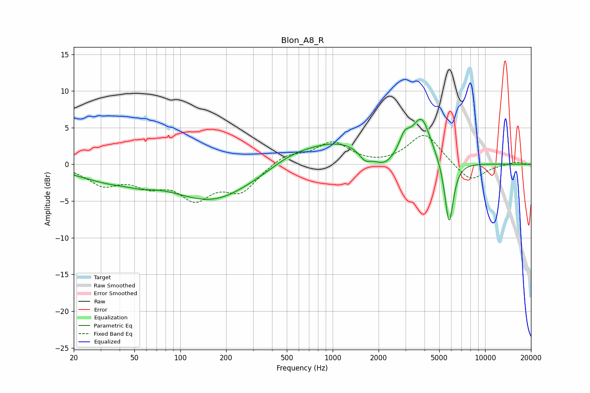

# Blon_A8_R
See [usage instructions](https://github.com/jaakkopasanen/AutoEq#usage) for more options and info.

### Parametric EQs
Apply preamp of -6.2 dB when using parametric equalizer.

|   # | Type    |   Fc (Hz) |    Q |   Gain (dB) |
|-----|---------|-----------|------|-------------|
|   1 | Peaking |        35 | 0.67 |        -1.9 |
|   2 | Peaking |        56 | 1.9  |        -0.5 |
|   3 | Peaking |       163 | 0.53 |        -4.8 |
|   4 | Peaking |       520 | 1.2  |         0.7 |
|   5 | Peaking |      1046 | 0.56 |         3.2 |
|   6 | Peaking |      1630 | 3.74 |        -1.3 |
|   7 | Peaking |      2172 | 1.9  |        -2.1 |
|   8 | Peaking |      2962 | 4.05 |         2.2 |
|   9 | Peaking |      3825 | 2.25 |         5.9 |
|  10 | Peaking |      5803 | 4.81 |        -9   |

### Fixed Band EQs
When using fixed band (also called graphic) equalizer, apply preamp of **-4.0 dB** (if available) and set gains manually with these parameters.

|   # | Type    |   Fc (Hz) |    Q |   Gain (dB) |
|-----|---------|-----------|------|-------------|
|   1 | Peaking |        31 | 1.41 |        -2.5 |
|   2 | Peaking |        62 | 1.41 |        -2.2 |
|   3 | Peaking |       125 | 1.41 |        -4.1 |
|   4 | Peaking |       250 | 1.41 |        -3.4 |
|   5 | Peaking |       500 | 1.41 |         1.4 |
|   6 | Peaking |      1000 | 1.41 |         2.9 |
|   7 | Peaking |      2000 | 1.41 |        -0.2 |
|   8 | Peaking |      4000 | 1.41 |         4.2 |
|   9 | Peaking |      8000 | 1.41 |        -2.5 |
|  10 | Peaking |     16000 | 1.41 |         0.4 |

### Graphs

