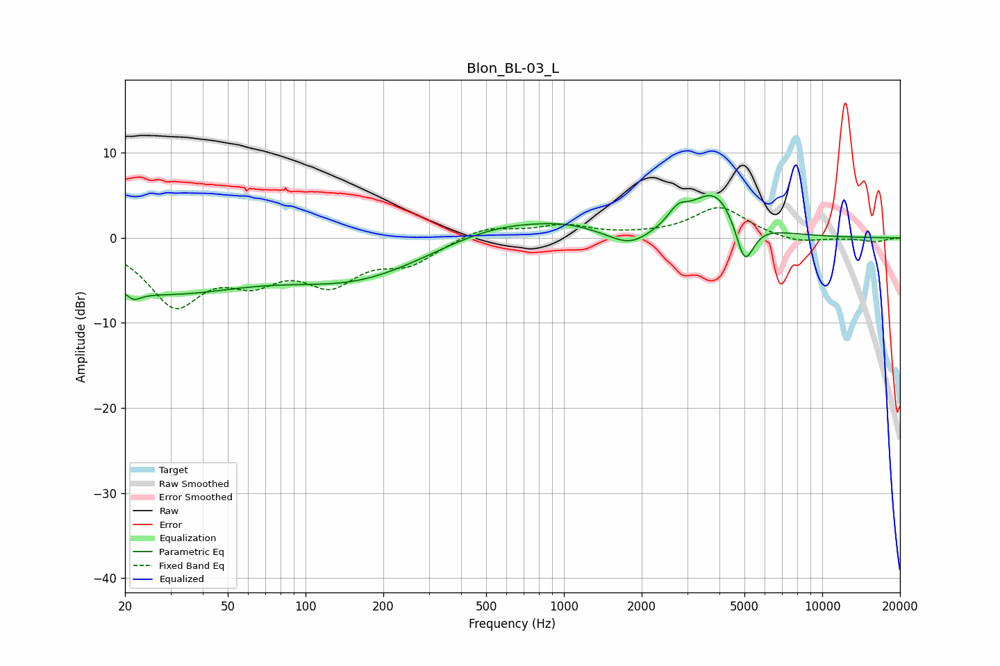

# Blon_BL-03_L
See [usage instructions](https://github.com/jaakkopasanen/AutoEq#usage) for more options and info.

### Parametric EQs
Apply preamp of -5.1 dB when using parametric equalizer.

|   # | Type    |   Fc (Hz) |    Q |   Gain (dB) |
|-----|---------|-----------|------|-------------|
|   1 | Peaking |        20 | 5.91 |         3.3 |
|   2 | Peaking |        21 | 4.82 |        -4.1 |
|   3 | Peaking |        27 | 0.4  |        -6   |
|   4 | Peaking |       159 | 0.51 |        -4.4 |
|   5 | Peaking |       558 | 0.65 |         2.1 |
|   6 | Peaking |      1020 | 1.11 |         0.9 |
|   7 | Peaking |      1805 | 1.75 |        -1.9 |
|   8 | Peaking |      2761 | 3.89 |         1.6 |
|   9 | Peaking |      3859 | 1.4  |         5.7 |
|  10 | Peaking |      5007 | 3.77 |        -5.7 |

### Fixed Band EQs
When using fixed band (also called graphic) equalizer, apply preamp of **-3.7 dB** (if available) and set gains manually with these parameters.

|   # | Type    |   Fc (Hz) |    Q |   Gain (dB) |
|-----|---------|-----------|------|-------------|
|   1 | Peaking |        31 | 1.41 |        -7.4 |
|   2 | Peaking |        62 | 1.41 |        -3.8 |
|   3 | Peaking |       125 | 1.41 |        -4.7 |
|   4 | Peaking |       250 | 1.41 |        -2.7 |
|   5 | Peaking |       500 | 1.41 |         1.4 |
|   6 | Peaking |      1000 | 1.41 |         1.3 |
|   7 | Peaking |      2000 | 1.41 |         0.2 |
|   8 | Peaking |      4000 | 1.41 |         3.6 |
|   9 | Peaking |      8000 | 1.41 |        -0.7 |
|  10 | Peaking |     16000 | 1.41 |        -0.5 |

### Graphs

