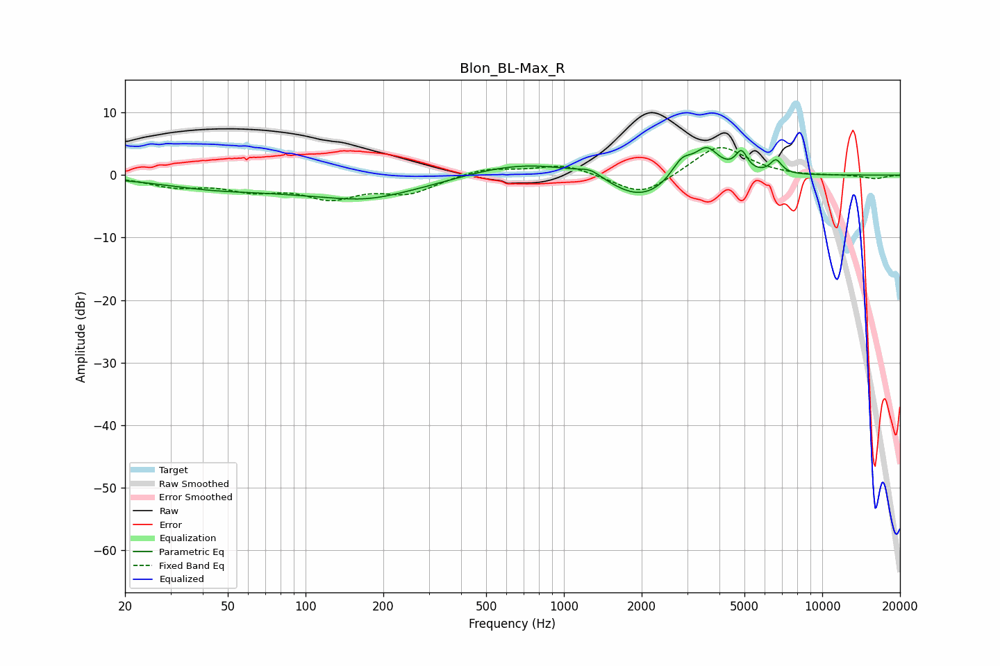

# Blon_BL-Max_R
See [usage instructions](https://github.com/jaakkopasanen/AutoEq#usage) for more options and info.

### Parametric EQs
Apply preamp of -4.5 dB when using parametric equalizer.

|   # | Type    |   Fc (Hz) |    Q |   Gain (dB) |
|-----|---------|-----------|------|-------------|
|   1 | Peaking |        43 | 0.67 |        -1.5 |
|   2 | Peaking |       174 | 1.26 |        -0.6 |
|   3 | Peaking |       175 | 0.43 |        -3.5 |
|   4 | Peaking |       685 | 0.53 |         2.9 |
|   5 | Peaking |      1267 | 3.17 |         1.1 |
|   6 | Peaking |      1977 | 1.11 |        -4.5 |
|   7 | Peaking |      2861 | 3.4  |         3.1 |
|   8 | Peaking |      3574 | 2.88 |         4.4 |
|   9 | Peaking |      4866 | 6    |         3.2 |
|  10 | Peaking |      6618 | 6    |         2.2 |

### Fixed Band EQs
When using fixed band (also called graphic) equalizer, apply preamp of **-4.5 dB** (if available) and set gains manually with these parameters.

|   # | Type    |   Fc (Hz) |    Q |   Gain (dB) |
|-----|---------|-----------|------|-------------|
|   1 | Peaking |        31 | 1.41 |        -1.6 |
|   2 | Peaking |        62 | 1.41 |        -2   |
|   3 | Peaking |       125 | 1.41 |        -3.2 |
|   4 | Peaking |       250 | 1.41 |        -2.6 |
|   5 | Peaking |       500 | 1.41 |         1.2 |
|   6 | Peaking |      1000 | 1.41 |         1.7 |
|   7 | Peaking |      2000 | 1.41 |        -3.5 |
|   8 | Peaking |      4000 | 1.41 |         5   |
|   9 | Peaking |      8000 | 1.41 |        -0.2 |
|  10 | Peaking |     16000 | 1.41 |        -0.6 |

### Graphs

