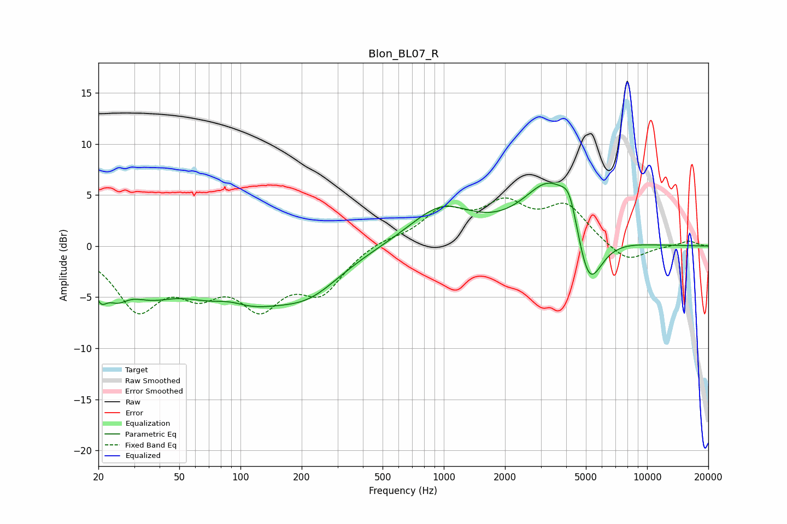

# Blon_BL07_R
See [usage instructions](https://github.com/jaakkopasanen/AutoEq#usage) for more options and info.

### Parametric EQs
Apply preamp of -6.2 dB when using parametric equalizer.

|   # | Type    |   Fc (Hz) |    Q |   Gain (dB) |
|-----|---------|-----------|------|-------------|
|   1 | Peaking |        20 | 4.22 |        -2.7 |
|   2 | Peaking |        25 | 2.57 |        -2.2 |
|   3 | Peaking |        35 | 1.15 |        -2.7 |
|   4 | Peaking |        89 | 1.48 |         1.5 |
|   5 | Peaking |        92 | 0.63 |        -5.8 |
|   6 | Peaking |       219 | 0.86 |        -3.1 |
|   7 | Peaking |       970 | 0.91 |         3.7 |
|   8 | Peaking |      3351 | 1.05 |         6.4 |
|   9 | Peaking |      4160 | 3.51 |         2.9 |
|  10 | Peaking |      5155 | 2.08 |        -6.6 |

### Fixed Band EQs
When using fixed band (also called graphic) equalizer, apply preamp of **-4.8 dB** (if available) and set gains manually with these parameters.

|   # | Type    |   Fc (Hz) |    Q |   Gain (dB) |
|-----|---------|-----------|------|-------------|
|   1 | Peaking |        31 | 1.41 |        -5.8 |
|   2 | Peaking |        62 | 1.41 |        -3.4 |
|   3 | Peaking |       125 | 1.41 |        -5.1 |
|   4 | Peaking |       250 | 1.41 |        -4   |
|   5 | Peaking |       500 | 1.41 |         0.6 |
|   6 | Peaking |      1000 | 1.41 |         3.2 |
|   7 | Peaking |      2000 | 1.41 |         3.6 |
|   8 | Peaking |      4000 | 1.41 |         3.7 |
|   9 | Peaking |      8000 | 1.41 |        -1.7 |
|  10 | Peaking |     16000 | 1.41 |         0.5 |

### Graphs

