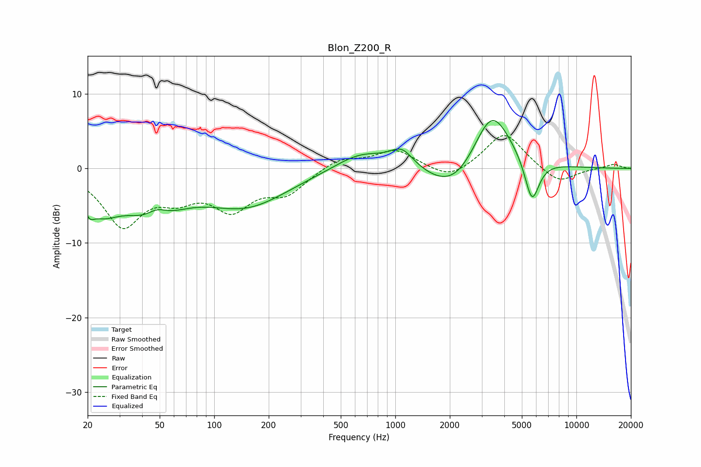

# Blon_Z200_R
See [usage instructions](https://github.com/jaakkopasanen/AutoEq#usage) for more options and info.

### Parametric EQs
Apply preamp of -6.5 dB when using parametric equalizer.

|   # | Type    |   Fc (Hz) |    Q |   Gain (dB) |
|-----|---------|-----------|------|-------------|
|   1 | Peaking |        20 | 5.92 |        -1.4 |
|   2 | Peaking |        24 | 1.31 |        -4.4 |
|   3 | Peaking |        46 | 1    |        -5.6 |
|   4 | Peaking |        48 | 2.24 |         2.2 |
|   5 | Peaking |       150 | 0.6  |        -4.8 |
|   6 | Peaking |       652 | 0.95 |         2.4 |
|   7 | Peaking |      1088 | 2.16 |         2.4 |
|   8 | Peaking |      2148 | 0.93 |        -4.6 |
|   9 | Peaking |      3397 | 1.26 |         9.1 |
|  10 | Peaking |      5684 | 3.4  |        -6.1 |

### Fixed Band EQs
When using fixed band (also called graphic) equalizer, apply preamp of **-4.5 dB** (if available) and set gains manually with these parameters.

|   # | Type    |   Fc (Hz) |    Q |   Gain (dB) |
|-----|---------|-----------|------|-------------|
|   1 | Peaking |        31 | 1.41 |        -7.3 |
|   2 | Peaking |        62 | 1.41 |        -2.9 |
|   3 | Peaking |       125 | 1.41 |        -4.9 |
|   4 | Peaking |       250 | 1.41 |        -3   |
|   5 | Peaking |       500 | 1.41 |         1.4 |
|   6 | Peaking |      1000 | 1.41 |         2.4 |
|   7 | Peaking |      2000 | 1.41 |        -1.7 |
|   8 | Peaking |      4000 | 1.41 |         4.9 |
|   9 | Peaking |      8000 | 1.41 |        -2.1 |
|  10 | Peaking |     16000 | 1.41 |         0.6 |

### Graphs

