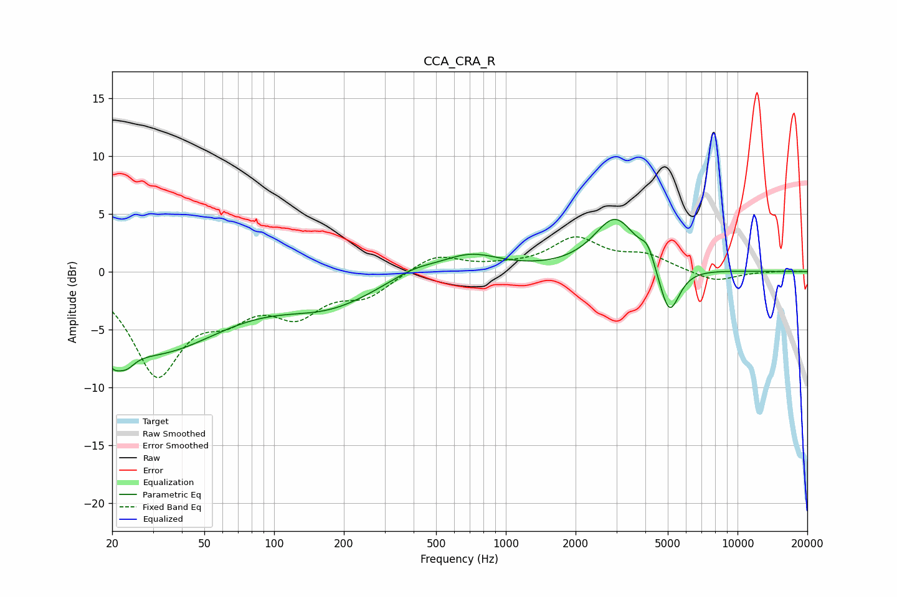

# CCA_CRA_R
See [usage instructions](https://github.com/jaakkopasanen/AutoEq#usage) for more options and info.

### Parametric EQs
Apply preamp of -4.6 dB when using parametric equalizer.

|   # | Type    |   Fc (Hz) |    Q |   Gain (dB) |
|-----|---------|-----------|------|-------------|
|   1 | Peaking |        20 | 5.28 |        -7.7 |
|   2 | Peaking |        20 | 6    |         5.6 |
|   3 | Peaking |        23 | 3.75 |        -1.2 |
|   4 | Peaking |        30 | 0.47 |        -6.7 |
|   5 | Peaking |       173 | 0.67 |        -2.6 |
|   6 | Peaking |       397 | 1.38 |         0.8 |
|   7 | Peaking |       701 | 1.1  |         1.6 |
|   8 | Peaking |      2970 | 1.53 |         4.6 |
|   9 | Peaking |      4099 | 4.76 |         1.4 |
|  10 | Peaking |      5071 | 3.15 |        -4.4 |

### Fixed Band EQs
When using fixed band (also called graphic) equalizer, apply preamp of **-3.1 dB** (if available) and set gains manually with these parameters.

|   # | Type    |   Fc (Hz) |    Q |   Gain (dB) |
|-----|---------|-----------|------|-------------|
|   1 | Peaking |        31 | 1.41 |        -8.5 |
|   2 | Peaking |        62 | 1.41 |        -2.7 |
|   3 | Peaking |       125 | 1.41 |        -3.2 |
|   4 | Peaking |       250 | 1.41 |        -1.9 |
|   5 | Peaking |       500 | 1.41 |         1.5 |
|   6 | Peaking |      1000 | 1.41 |         0.3 |
|   7 | Peaking |      2000 | 1.41 |         2.7 |
|   8 | Peaking |      4000 | 1.41 |         1.3 |
|   9 | Peaking |      8000 | 1.41 |        -0.9 |
|  10 | Peaking |     16000 | 1.41 |         0.1 |

### Graphs

