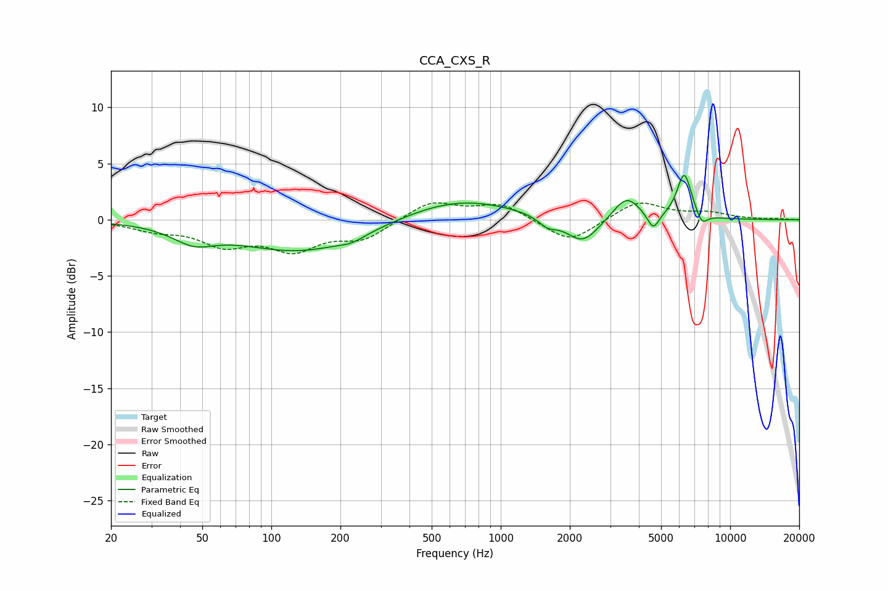

# CCA_CXS_R
See [usage instructions](https://github.com/jaakkopasanen/AutoEq#usage) for more options and info.

### Parametric EQs
Apply preamp of -4.0 dB when using parametric equalizer.

|   # | Type    |   Fc (Hz) |    Q |   Gain (dB) |
|-----|---------|-----------|------|-------------|
|   1 | Peaking |        46 | 1.56 |        -1.4 |
|   2 | Peaking |       135 | 0.52 |        -2.8 |
|   3 | Peaking |       225 | 2.52 |        -0.4 |
|   4 | Peaking |       650 | 0.58 |         1.9 |
|   5 | Peaking |      1603 | 3.49 |        -0.8 |
|   6 | Peaking |      2273 | 1.99 |        -2.3 |
|   7 | Peaking |      3535 | 2.42 |         2.1 |
|   8 | Peaking |      4621 | 5.4  |        -1.5 |
|   9 | Peaking |      6310 | 4.31 |         4.1 |
|  10 | Peaking |      7533 | 5.71 |        -1.1 |

### Fixed Band EQs
When using fixed band (also called graphic) equalizer, apply preamp of **-1.6 dB** (if available) and set gains manually with these parameters.

|   # | Type    |   Fc (Hz) |    Q |   Gain (dB) |
|-----|---------|-----------|------|-------------|
|   1 | Peaking |        31 | 1.41 |        -0.8 |
|   2 | Peaking |        62 | 1.41 |        -2   |
|   3 | Peaking |       125 | 1.41 |        -2.4 |
|   4 | Peaking |       250 | 1.41 |        -1.6 |
|   5 | Peaking |       500 | 1.41 |         1.7 |
|   6 | Peaking |      1000 | 1.41 |         1.4 |
|   7 | Peaking |      2000 | 1.41 |        -2.1 |
|   8 | Peaking |      4000 | 1.41 |         1.7 |
|   9 | Peaking |      8000 | 1.41 |         0.6 |
|  10 | Peaking |     16000 | 1.41 |         0.1 |

### Graphs

