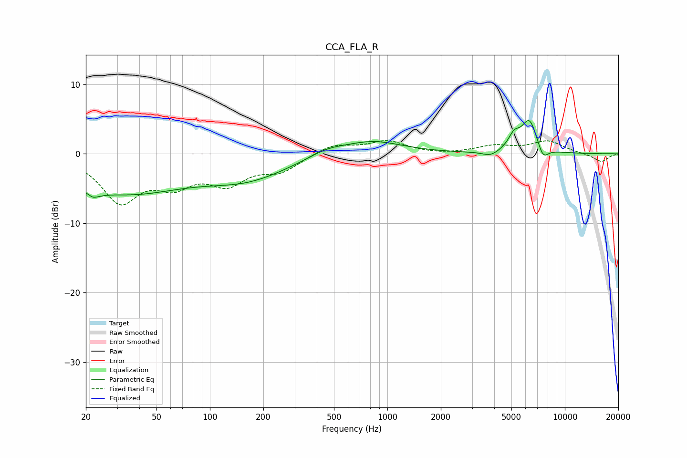

# CCA_FLA_R
See [usage instructions](https://github.com/jaakkopasanen/AutoEq#usage) for more options and info.

### Parametric EQs
Apply preamp of -4.9 dB when using parametric equalizer.

|   # | Type    |   Fc (Hz) |    Q |   Gain (dB) |
|-----|---------|-----------|------|-------------|
|   1 | Peaking |        20 | 3.54 |        -4.6 |
|   2 | Peaking |        20 | 5.45 |         3.5 |
|   3 | Peaking |        33 | 0.41 |        -5.4 |
|   4 | Peaking |       164 | 0.59 |        -3.1 |
|   5 | Peaking |       452 | 1.41 |         0.9 |
|   6 | Peaking |       815 | 0.83 |         1.9 |
|   7 | Peaking |      3813 | 3.07 |        -0.7 |
|   8 | Peaking |      5174 | 4.14 |         2   |
|   9 | Peaking |      6314 | 3.08 |         4.8 |
|  10 | Peaking |      7523 | 4.44 |        -1.9 |

### Fixed Band EQs
When using fixed band (also called graphic) equalizer, apply preamp of **-2.0 dB** (if available) and set gains manually with these parameters.

|   # | Type    |   Fc (Hz) |    Q |   Gain (dB) |
|-----|---------|-----------|------|-------------|
|   1 | Peaking |        31 | 1.41 |        -6.5 |
|   2 | Peaking |        62 | 1.41 |        -3.6 |
|   3 | Peaking |       125 | 1.41 |        -3.7 |
|   4 | Peaking |       250 | 1.41 |        -2.2 |
|   5 | Peaking |       500 | 1.41 |         1.4 |
|   6 | Peaking |      1000 | 1.41 |         1.7 |
|   7 | Peaking |      2000 | 1.41 |        -0.2 |
|   8 | Peaking |      4000 | 1.41 |         1   |
|   9 | Peaking |      8000 | 1.41 |         1.8 |
|  10 | Peaking |     16000 | 1.41 |        -1.2 |

### Graphs

