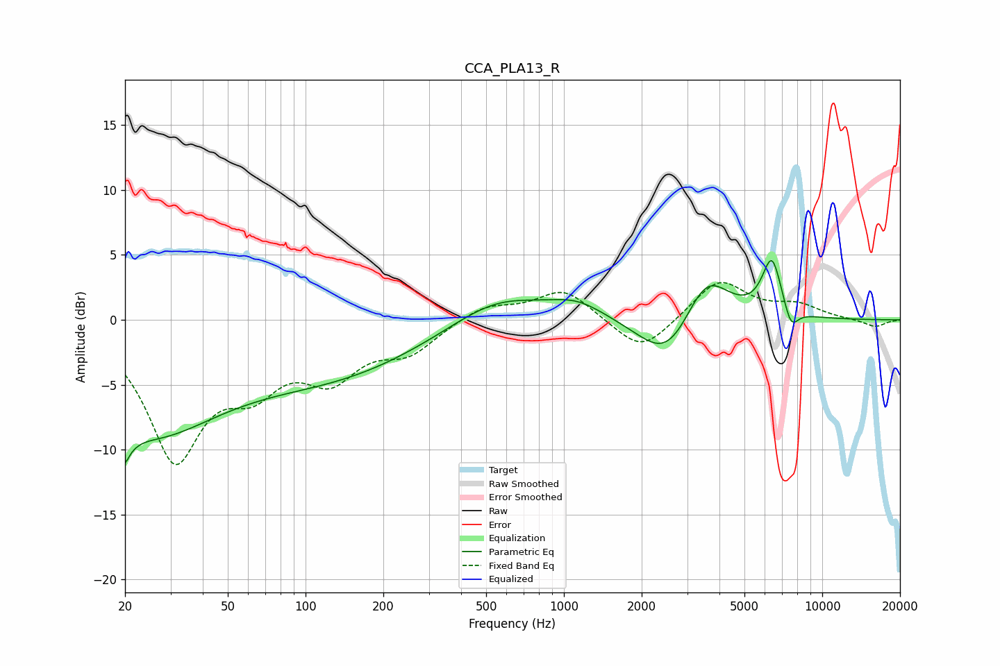

# CCA_PLA13_R
See [usage instructions](https://github.com/jaakkopasanen/AutoEq#usage) for more options and info.

### Parametric EQs
Apply preamp of -4.7 dB when using parametric equalizer.

|   # | Type    |   Fc (Hz) |    Q |   Gain (dB) |
|-----|---------|-----------|------|-------------|
|   1 | Peaking |        20 | 5.04 |        -6.3 |
|   2 | Peaking |        20 | 5.54 |         3.5 |
|   3 | Peaking |        25 | 0.51 |        -8   |
|   4 | Peaking |       130 | 0.4  |        -3.8 |
|   5 | Peaking |       551 | 0.77 |         2.2 |
|   6 | Peaking |      1124 | 1.29 |         1.2 |
|   7 | Peaking |      2527 | 1.27 |        -3.8 |
|   8 | Peaking |      3548 | 1.56 |         4.2 |
|   9 | Peaking |      6385 | 3.59 |         4.5 |
|  10 | Peaking |      7567 | 4.83 |        -1.7 |

### Fixed Band EQs
When using fixed band (also called graphic) equalizer, apply preamp of **-3.0 dB** (if available) and set gains manually with these parameters.

|   # | Type    |   Fc (Hz) |    Q |   Gain (dB) |
|-----|---------|-----------|------|-------------|
|   1 | Peaking |        31 | 1.41 |       -10.3 |
|   2 | Peaking |        62 | 1.41 |        -3.9 |
|   3 | Peaking |       125 | 1.41 |        -3.8 |
|   4 | Peaking |       250 | 1.41 |        -2.2 |
|   5 | Peaking |       500 | 1.41 |         1.2 |
|   6 | Peaking |      1000 | 1.41 |         2.4 |
|   7 | Peaking |      2000 | 1.41 |        -2.7 |
|   8 | Peaking |      4000 | 1.41 |         3.1 |
|   9 | Peaking |      8000 | 1.41 |         1   |
|  10 | Peaking |     16000 | 1.41 |        -0.6 |

### Graphs

