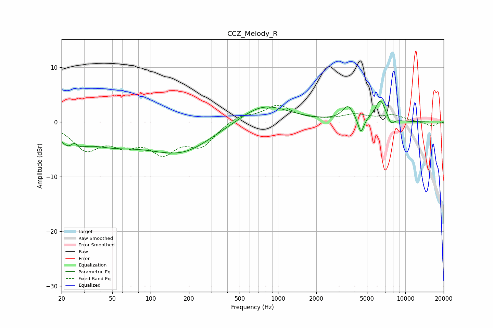

# CCZ_Melody_R
See [usage instructions](https://github.com/jaakkopasanen/AutoEq#usage) for more options and info.

### Parametric EQs
Apply preamp of -3.9 dB when using parametric equalizer.

|   # | Type    |   Fc (Hz) |    Q |   Gain (dB) |
|-----|---------|-----------|------|-------------|
|   1 | Peaking |        24 | 1.73 |        -3.6 |
|   2 | Peaking |        25 | 5.07 |         1.5 |
|   3 | Peaking |        48 | 0.68 |        -2.9 |
|   4 | Peaking |       166 | 0.51 |        -5.1 |
|   5 | Peaking |       197 | 1.26 |        -0.3 |
|   6 | Peaking |       764 | 0.74 |         3.6 |
|   7 | Peaking |      3543 | 3.2  |         2.7 |
|   8 | Peaking |      4478 | 6    |        -3   |
|   9 | Peaking |      6371 | 3.32 |         3.9 |
|  10 | Peaking |      7704 | 5.43 |        -1.3 |

### Fixed Band EQs
When using fixed band (also called graphic) equalizer, apply preamp of **-3.2 dB** (if available) and set gains manually with these parameters.

|   # | Type    |   Fc (Hz) |    Q |   Gain (dB) |
|-----|---------|-----------|------|-------------|
|   1 | Peaking |        31 | 1.41 |        -4.6 |
|   2 | Peaking |        62 | 1.41 |        -3.2 |
|   3 | Peaking |       125 | 1.41 |        -4.9 |
|   4 | Peaking |       250 | 1.41 |        -4   |
|   5 | Peaking |       500 | 1.41 |         1.3 |
|   6 | Peaking |      1000 | 1.41 |         2.9 |
|   7 | Peaking |      2000 | 1.41 |         0.2 |
|   8 | Peaking |      4000 | 1.41 |         1.2 |
|   9 | Peaking |      8000 | 1.41 |         1.2 |
|  10 | Peaking |     16000 | 1.41 |        -0.8 |

### Graphs

