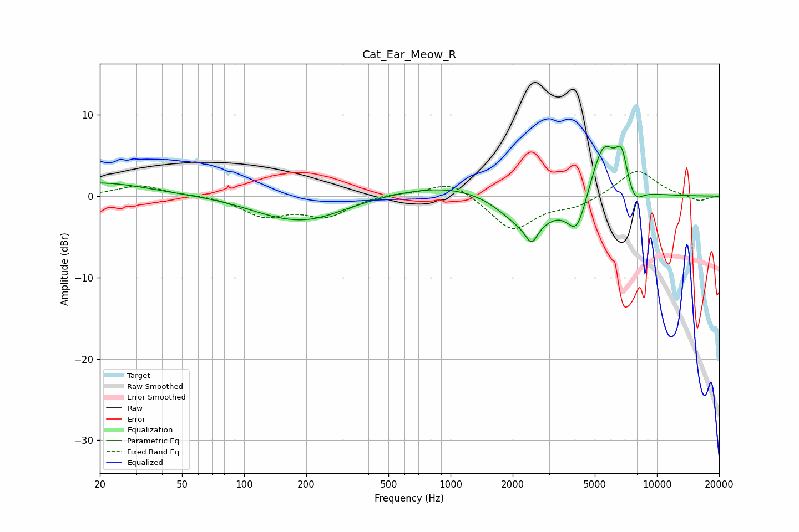

# Cat_Ear_Meow_R
See [usage instructions](https://github.com/jaakkopasanen/AutoEq#usage) for more options and info.

### Parametric EQs
Apply preamp of -6.2 dB when using parametric equalizer.

|   # | Type    |   Fc (Hz) |    Q |   Gain (dB) |
|-----|---------|-----------|------|-------------|
|   1 | Peaking |        20 | 0.6  |         1.7 |
|   2 | Peaking |       132 | 0.97 |        -0.7 |
|   3 | Peaking |       204 | 0.75 |        -2.7 |
|   4 | Peaking |      1083 | 0.51 |         1.8 |
|   5 | Peaking |      2328 | 1.1  |        -4.5 |
|   6 | Peaking |      2471 | 5.12 |        -2.1 |
|   7 | Peaking |      4094 | 2.97 |        -4.6 |
|   8 | Peaking |      5511 | 2.18 |         7   |
|   9 | Peaking |      6741 | 4.77 |         4   |
|  10 | Peaking |      7781 | 3.5  |        -2.1 |

### Fixed Band EQs
When using fixed band (also called graphic) equalizer, apply preamp of **-3.1 dB** (if available) and set gains manually with these parameters.

|   # | Type    |   Fc (Hz) |    Q |   Gain (dB) |
|-----|---------|-----------|------|-------------|
|   1 | Peaking |        31 | 1.41 |         1.3 |
|   2 | Peaking |        62 | 1.41 |         0.1 |
|   3 | Peaking |       125 | 1.41 |        -2.3 |
|   4 | Peaking |       250 | 1.41 |        -2.3 |
|   5 | Peaking |       500 | 1.41 |         0.4 |
|   6 | Peaking |      1000 | 1.41 |         2   |
|   7 | Peaking |      2000 | 1.41 |        -4.2 |
|   8 | Peaking |      4000 | 1.41 |        -1.2 |
|   9 | Peaking |      8000 | 1.41 |         3.3 |
|  10 | Peaking |     16000 | 1.41 |        -0.7 |

### Graphs

