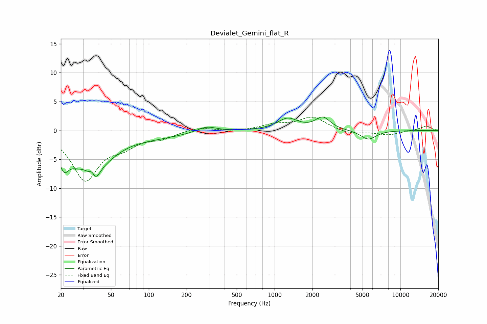

# Devialet_Gemini_flat_R
See [usage instructions](https://github.com/jaakkopasanen/AutoEq#usage) for more options and info.

### Parametric EQs
Apply preamp of -2.4 dB when using parametric equalizer.

|   # | Type    |   Fc (Hz) |    Q |   Gain (dB) |
|-----|---------|-----------|------|-------------|
|   1 | Peaking |        21 | 3.62 |        -4   |
|   2 | Peaking |        26 | 1.68 |        -3.3 |
|   3 | Peaking |        36 | 5.37 |         3.3 |
|   4 | Peaking |        36 | 3.39 |        -6.1 |
|   5 | Peaking |        45 | 1.09 |        -3.1 |
|   6 | Peaking |       105 | 0.54 |        -1.1 |
|   7 | Peaking |       288 | 1.83 |         1   |
|   8 | Peaking |      1269 | 1.75 |         2   |
|   9 | Peaking |      2418 | 2.42 |         2.1 |
|  10 | Peaking |      5557 | 2.24 |        -1.6 |

### Fixed Band EQs
When using fixed band (also called graphic) equalizer, apply preamp of **-2.4 dB** (if available) and set gains manually with these parameters.

|   # | Type    |   Fc (Hz) |    Q |   Gain (dB) |
|-----|---------|-----------|------|-------------|
|   1 | Peaking |        31 | 1.41 |        -8.4 |
|   2 | Peaking |        62 | 1.41 |        -2.1 |
|   3 | Peaking |       125 | 1.41 |        -1.1 |
|   4 | Peaking |       250 | 1.41 |         0.6 |
|   5 | Peaking |       500 | 1.41 |        -0.2 |
|   6 | Peaking |      1000 | 1.41 |         0.9 |
|   7 | Peaking |      2000 | 1.41 |         2.3 |
|   8 | Peaking |      4000 | 1.41 |        -0.7 |
|   9 | Peaking |      8000 | 1.41 |        -0.8 |
|  10 | Peaking |     16000 | 1.41 |         0.8 |

### Graphs

