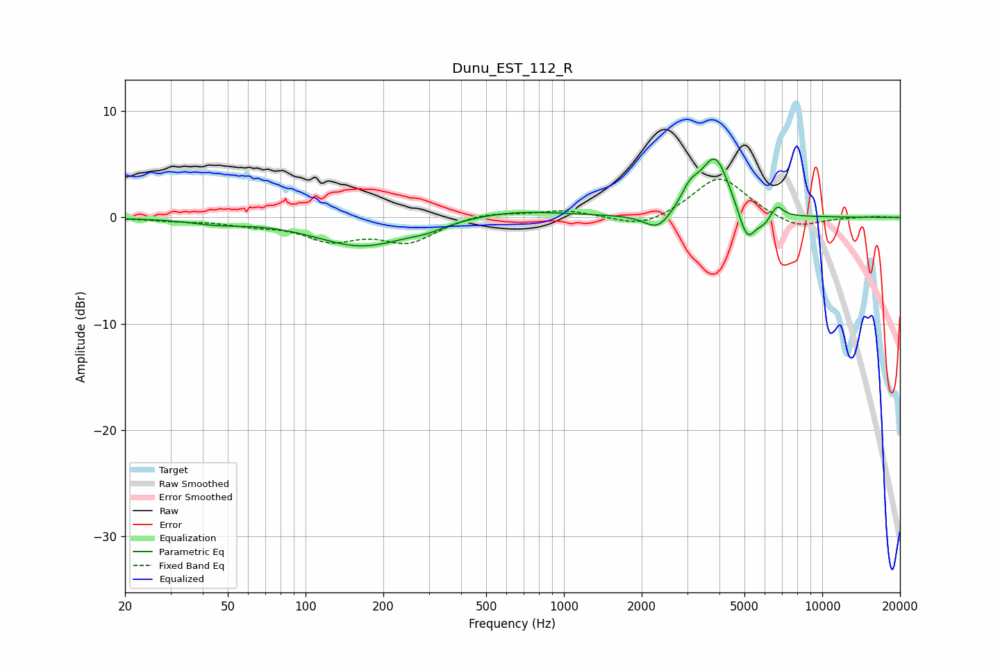

# Dunu_EST_112_R
See [usage instructions](https://github.com/jaakkopasanen/AutoEq#usage) for more options and info.

### Parametric EQs
Apply preamp of -5.6 dB when using parametric equalizer.

|   # | Type    |   Fc (Hz) |    Q |   Gain (dB) |
|-----|---------|-----------|------|-------------|
|   1 | Peaking |        45 | 1.37 |        -0.4 |
|   2 | Peaking |       166 | 0.78 |        -2.7 |
|   3 | Peaking |       297 | 2.05 |        -0.4 |
|   4 | Peaking |       628 | 0.71 |         0.7 |
|   5 | Peaking |      2306 | 2.75 |        -1.6 |
|   6 | Peaking |      3080 | 3.9  |         1.7 |
|   7 | Peaking |      3856 | 2.49 |         5.6 |
|   8 | Peaking |      5121 | 4.14 |        -3.2 |
|   9 | Peaking |      5944 | 5.25 |        -0.7 |
|  10 | Peaking |      6692 | 6    |         1.1 |

### Fixed Band EQs
When using fixed band (also called graphic) equalizer, apply preamp of **-3.7 dB** (if available) and set gains manually with these parameters.

|   # | Type    |   Fc (Hz) |    Q |   Gain (dB) |
|-----|---------|-----------|------|-------------|
|   1 | Peaking |        31 | 1.41 |        -0.2 |
|   2 | Peaking |        62 | 1.41 |        -0.5 |
|   3 | Peaking |       125 | 1.41 |        -1.9 |
|   4 | Peaking |       250 | 1.41 |        -2.2 |
|   5 | Peaking |       500 | 1.41 |         0.5 |
|   6 | Peaking |      1000 | 1.41 |         0.7 |
|   7 | Peaking |      2000 | 1.41 |        -1.1 |
|   8 | Peaking |      4000 | 1.41 |         3.9 |
|   9 | Peaking |      8000 | 1.41 |        -1.1 |
|  10 | Peaking |     16000 | 1.41 |         0.1 |

### Graphs

