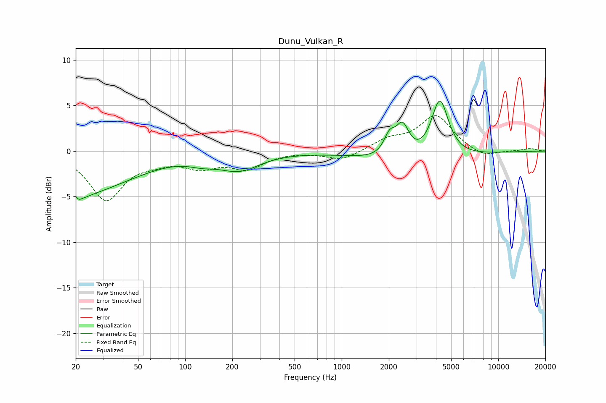

# Dunu_Vulkan_R
See [usage instructions](https://github.com/jaakkopasanen/AutoEq#usage) for more options and info.

### Parametric EQs
Apply preamp of -5.6 dB when using parametric equalizer.

|   # | Type    |   Fc (Hz) |    Q |   Gain (dB) |
|-----|---------|-----------|------|-------------|
|   1 | Peaking |        22 | 5.1  |        -4.2 |
|   2 | Peaking |        22 | 5.64 |         3.3 |
|   3 | Peaking |        22 | 0.76 |        -3.6 |
|   4 | Peaking |        43 | 0.63 |        -1.4 |
|   5 | Peaking |       128 | 1.66 |        -0.6 |
|   6 | Peaking |       221 | 1.07 |        -1.9 |
|   7 | Peaking |      2022 | 3.89 |         2.1 |
|   8 | Peaking |      2446 | 3.31 |         3.4 |
|   9 | Peaking |      2878 | 0.5  |        -1.5 |
|  10 | Peaking |      4234 | 2.55 |         6.6 |

### Fixed Band EQs
When using fixed band (also called graphic) equalizer, apply preamp of **-4.0 dB** (if available) and set gains manually with these parameters.

|   # | Type    |   Fc (Hz) |    Q |   Gain (dB) |
|-----|---------|-----------|------|-------------|
|   1 | Peaking |        31 | 1.41 |        -5.2 |
|   2 | Peaking |        62 | 1.41 |        -0.8 |
|   3 | Peaking |       125 | 1.41 |        -1.5 |
|   4 | Peaking |       250 | 1.41 |        -1.7 |
|   5 | Peaking |       500 | 1.41 |         0   |
|   6 | Peaking |      1000 | 1.41 |        -1   |
|   7 | Peaking |      2000 | 1.41 |         1.1 |
|   8 | Peaking |      4000 | 1.41 |         3.8 |
|   9 | Peaking |      8000 | 1.41 |        -0.8 |
|  10 | Peaking |     16000 | 1.41 |         0.3 |

### Graphs

