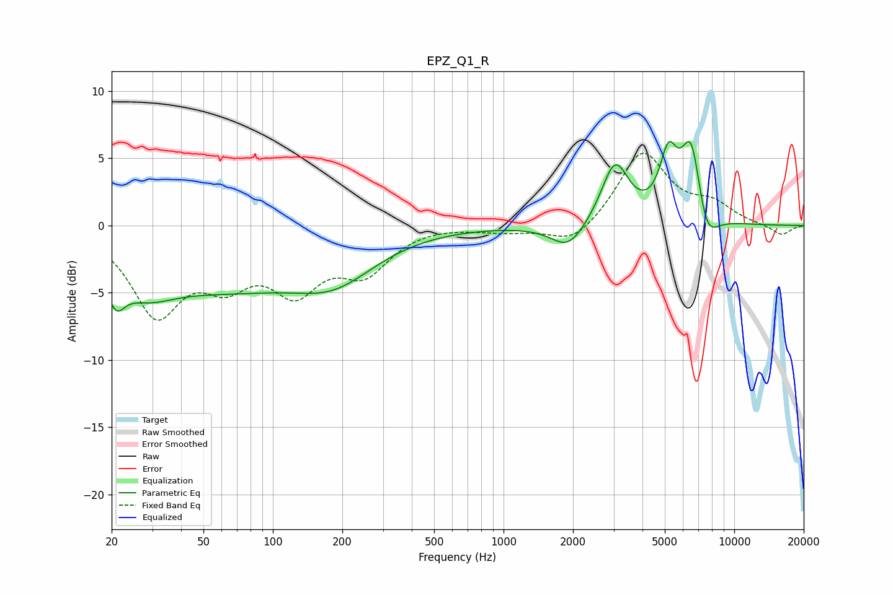

# EPZ_Q1_R
See [usage instructions](https://github.com/jaakkopasanen/AutoEq#usage) for more options and info.

### Parametric EQs
Apply preamp of -6.3 dB when using parametric equalizer.

|   # | Type    |   Fc (Hz) |    Q |   Gain (dB) |
|-----|---------|-----------|------|-------------|
|   1 | Peaking |        21 | 3.62 |        -2.5 |
|   2 | Peaking |        27 | 1.07 |        -2.6 |
|   3 | Peaking |        44 | 0.5  |        -2.4 |
|   4 | Peaking |        84 | 0.54 |        -1.9 |
|   5 | Peaking |       185 | 0.76 |        -3.2 |
|   6 | Peaking |      1910 | 1.91 |        -1.9 |
|   7 | Peaking |      3042 | 2.39 |         4.6 |
|   8 | Peaking |      5184 | 3.63 |         4.3 |
|   9 | Peaking |      6515 | 3    |         6.4 |
|  10 | Peaking |      7531 | 2.75 |        -2.9 |

### Fixed Band EQs
When using fixed band (also called graphic) equalizer, apply preamp of **-5.5 dB** (if available) and set gains manually with these parameters.

|   # | Type    |   Fc (Hz) |    Q |   Gain (dB) |
|-----|---------|-----------|------|-------------|
|   1 | Peaking |        31 | 1.41 |        -6.2 |
|   2 | Peaking |        62 | 1.41 |        -3.3 |
|   3 | Peaking |       125 | 1.41 |        -4.2 |
|   4 | Peaking |       250 | 1.41 |        -3.1 |
|   5 | Peaking |       500 | 1.41 |         0.1 |
|   6 | Peaking |      1000 | 1.41 |        -0.4 |
|   7 | Peaking |      2000 | 1.41 |        -1.6 |
|   8 | Peaking |      4000 | 1.41 |         5.5 |
|   9 | Peaking |      8000 | 1.41 |         1.4 |
|  10 | Peaking |     16000 | 1.41 |        -0.8 |

### Graphs

