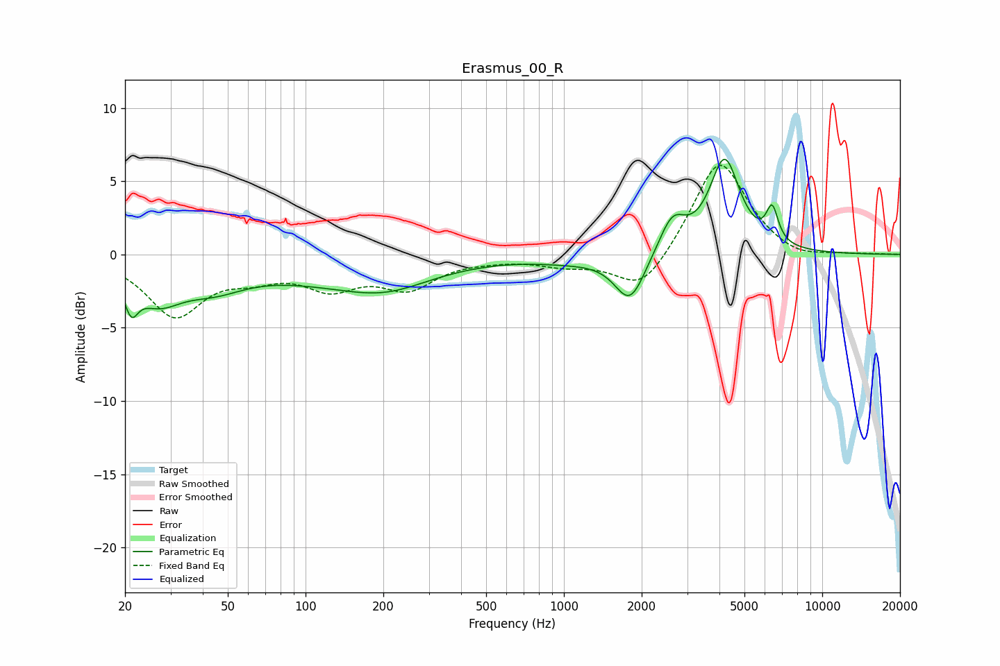

# Erasmus_00_R
See [usage instructions](https://github.com/jaakkopasanen/AutoEq#usage) for more options and info.

### Parametric EQs
Apply preamp of -6.6 dB when using parametric equalizer.

|   # | Type    |   Fc (Hz) |    Q |   Gain (dB) |
|-----|---------|-----------|------|-------------|
|   1 | Peaking |        21 | 5.47 |        -2.1 |
|   2 | Peaking |        27 | 1.53 |        -2.5 |
|   3 | Peaking |        44 | 1.08 |        -1.6 |
|   4 | Peaking |       141 | 0.46 |        -1.5 |
|   5 | Peaking |       207 | 0.88 |        -1.1 |
|   6 | Peaking |      1051 | 1.01 |        -0.4 |
|   7 | Peaking |      1803 | 2.39 |        -3.3 |
|   8 | Peaking |      2627 | 2.75 |         2.4 |
|   9 | Peaking |      4190 | 2.4  |         6.3 |
|  10 | Peaking |      6404 | 6    |         2.3 |

### Fixed Band EQs
When using fixed band (also called graphic) equalizer, apply preamp of **-6.2 dB** (if available) and set gains manually with these parameters.

|   # | Type    |   Fc (Hz) |    Q |   Gain (dB) |
|-----|---------|-----------|------|-------------|
|   1 | Peaking |        31 | 1.41 |        -4   |
|   2 | Peaking |        62 | 1.41 |        -1.1 |
|   3 | Peaking |       125 | 1.41 |        -2   |
|   4 | Peaking |       250 | 1.41 |        -2.1 |
|   5 | Peaking |       500 | 1.41 |        -0.2 |
|   6 | Peaking |      1000 | 1.41 |        -0.6 |
|   7 | Peaking |      2000 | 1.41 |        -2.7 |
|   8 | Peaking |      4000 | 1.41 |         6.6 |
|   9 | Peaking |      8000 | 1.41 |        -0.5 |
|  10 | Peaking |     16000 | 1.41 |         0   |

### Graphs

