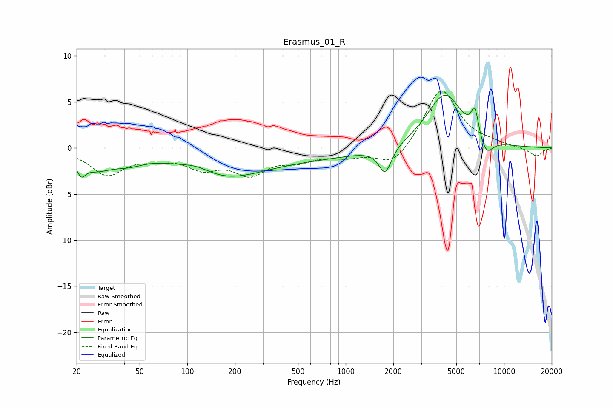

# Erasmus_01_R
See [usage instructions](https://github.com/jaakkopasanen/AutoEq#usage) for more options and info.

### Parametric EQs
Apply preamp of -5.8 dB when using parametric equalizer.

|   # | Type    |   Fc (Hz) |    Q |   Gain (dB) |
|-----|---------|-----------|------|-------------|
|   1 | Peaking |        21 | 5.45 |        -1.4 |
|   2 | Peaking |        26 | 1.33 |        -1.9 |
|   3 | Peaking |        43 | 1.42 |        -0.9 |
|   4 | Peaking |       115 | 1.43 |         0.8 |
|   5 | Peaking |       165 | 0.56 |        -3   |
|   6 | Peaking |       628 | 0.41 |        -0.9 |
|   7 | Peaking |      1777 | 3.58 |        -2.9 |
|   8 | Peaking |      4223 | 1.24 |         5.9 |
|   9 | Peaking |      6545 | 5.97 |         2.8 |
|  10 | Peaking |      7723 | 3.14 |        -1.9 |

### Fixed Band EQs
When using fixed band (also called graphic) equalizer, apply preamp of **-6.3 dB** (if available) and set gains manually with these parameters.

|   # | Type    |   Fc (Hz) |    Q |   Gain (dB) |
|-----|---------|-----------|------|-------------|
|   1 | Peaking |        31 | 1.41 |        -2.8 |
|   2 | Peaking |        62 | 1.41 |        -0.8 |
|   3 | Peaking |       125 | 1.41 |        -1.9 |
|   4 | Peaking |       250 | 1.41 |        -2.5 |
|   5 | Peaking |       500 | 1.41 |        -1.1 |
|   6 | Peaking |      1000 | 1.41 |        -0.8 |
|   7 | Peaking |      2000 | 1.41 |        -2.1 |
|   8 | Peaking |      4000 | 1.41 |         6.5 |
|   9 | Peaking |      8000 | 1.41 |         0.4 |
|  10 | Peaking |     16000 | 1.41 |        -0.9 |

### Graphs

