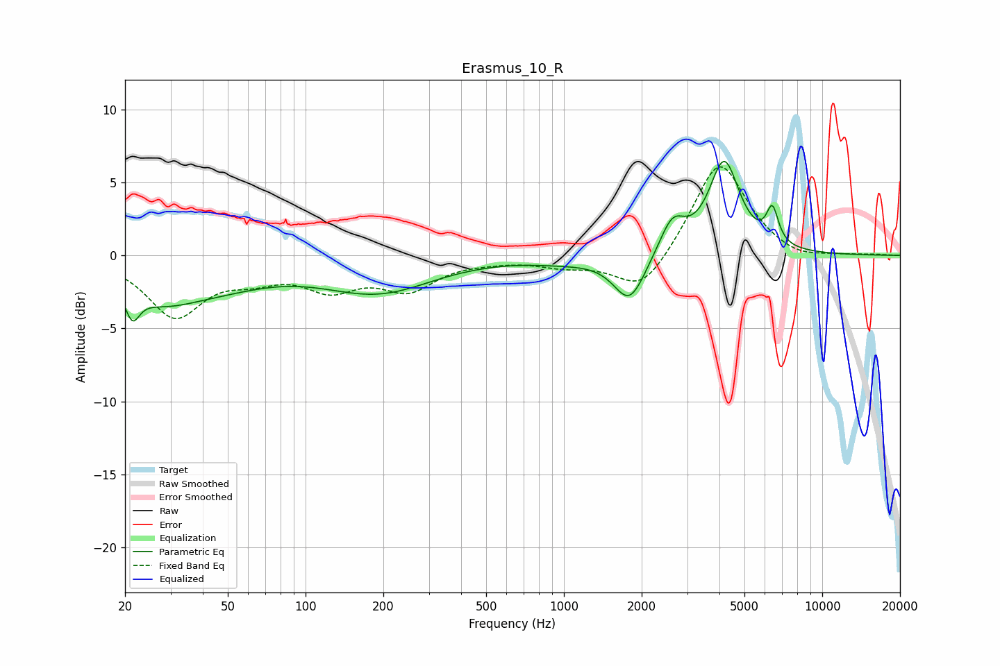

# Erasmus_10_R
See [usage instructions](https://github.com/jaakkopasanen/AutoEq#usage) for more options and info.

### Parametric EQs
Apply preamp of -6.5 dB when using parametric equalizer.

|   # | Type    |   Fc (Hz) |    Q |   Gain (dB) |
|-----|---------|-----------|------|-------------|
|   1 | Peaking |        21 | 5.26 |        -1.9 |
|   2 | Peaking |        27 | 0.95 |        -2.2 |
|   3 | Peaking |        47 | 0.67 |        -1.4 |
|   4 | Peaking |       176 | 0.66 |        -1.6 |
|   5 | Peaking |       216 | 0.73 |        -0.8 |
|   6 | Peaking |       999 | 1.04 |        -0.3 |
|   7 | Peaking |      1796 | 2.3  |        -3.2 |
|   8 | Peaking |      2629 | 2.85 |         2.3 |
|   9 | Peaking |      4173 | 2.38 |         6.3 |
|  10 | Peaking |      6412 | 6    |         2.4 |

### Fixed Band EQs
When using fixed band (also called graphic) equalizer, apply preamp of **-6.2 dB** (if available) and set gains manually with these parameters.

|   # | Type    |   Fc (Hz) |    Q |   Gain (dB) |
|-----|---------|-----------|------|-------------|
|   1 | Peaking |        31 | 1.41 |        -4   |
|   2 | Peaking |        62 | 1.41 |        -1.1 |
|   3 | Peaking |       125 | 1.41 |        -2   |
|   4 | Peaking |       250 | 1.41 |        -2.1 |
|   5 | Peaking |       500 | 1.41 |        -0.2 |
|   6 | Peaking |      1000 | 1.41 |        -0.6 |
|   7 | Peaking |      2000 | 1.41 |        -2.7 |
|   8 | Peaking |      4000 | 1.41 |         6.6 |
|   9 | Peaking |      8000 | 1.41 |        -0.5 |
|  10 | Peaking |     16000 | 1.41 |         0   |

### Graphs

