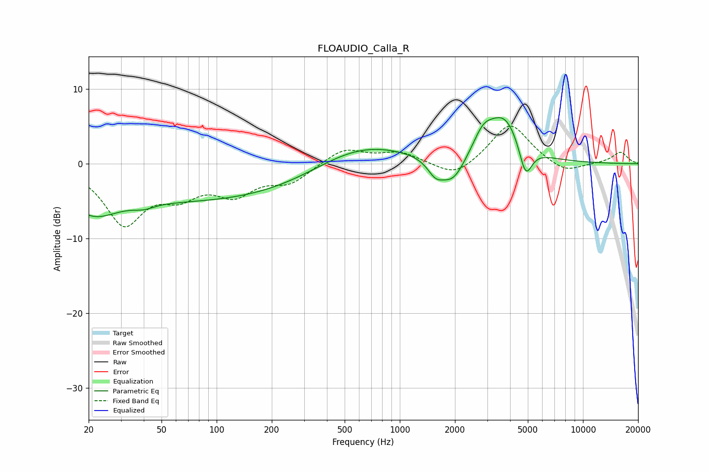

# FLOAUDIO_Calla_R
See [usage instructions](https://github.com/jaakkopasanen/AutoEq#usage) for more options and info.

### Parametric EQs
Apply preamp of -6.3 dB when using parametric equalizer.

|   # | Type    |   Fc (Hz) |    Q |   Gain (dB) |
|-----|---------|-----------|------|-------------|
|   1 | Peaking |        21 | 1.02 |        -4.1 |
|   2 | Peaking |        40 | 2.59 |        -0.6 |
|   3 | Peaking |       109 | 0.2  |        -7.9 |
|   4 | Peaking |       163 | 0.18 |         3.1 |
|   5 | Peaking |       580 | 0.55 |         3.2 |
|   6 | Peaking |      1566 | 3.25 |        -1.9 |
|   7 | Peaking |      1949 | 2.06 |        -3.6 |
|   8 | Peaking |      2850 | 2.57 |         2.6 |
|   9 | Peaking |      3738 | 1.47 |         6.1 |
|  10 | Peaking |      4860 | 3.88 |        -4.6 |

### Fixed Band EQs
When using fixed band (also called graphic) equalizer, apply preamp of **-5.1 dB** (if available) and set gains manually with these parameters.

|   # | Type    |   Fc (Hz) |    Q |   Gain (dB) |
|-----|---------|-----------|------|-------------|
|   1 | Peaking |        31 | 1.41 |        -7.7 |
|   2 | Peaking |        62 | 1.41 |        -3.3 |
|   3 | Peaking |       125 | 1.41 |        -3.5 |
|   4 | Peaking |       250 | 1.41 |        -2.3 |
|   5 | Peaking |       500 | 1.41 |         2.1 |
|   6 | Peaking |      1000 | 1.41 |         1.5 |
|   7 | Peaking |      2000 | 1.41 |        -2   |
|   8 | Peaking |      4000 | 1.41 |         5.5 |
|   9 | Peaking |      8000 | 1.41 |        -1.4 |
|  10 | Peaking |     16000 | 1.41 |         1.5 |

### Graphs

