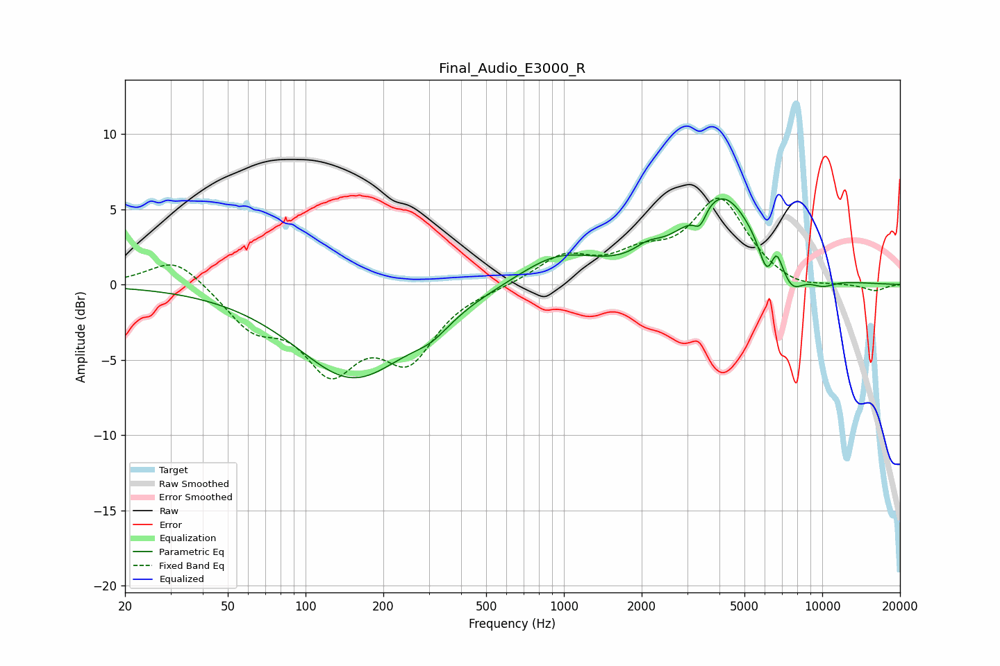

# Final_Audio_E3000_R
See [usage instructions](https://github.com/jaakkopasanen/AutoEq#usage) for more options and info.

### Parametric EQs
Apply preamp of -5.8 dB when using parametric equalizer.

|   # | Type    |   Fc (Hz) |    Q |   Gain (dB) |
|-----|---------|-----------|------|-------------|
|   1 | Peaking |       153 | 0.64 |        -6.2 |
|   2 | Peaking |       306 | 1.87 |        -0.9 |
|   3 | Peaking |       946 | 0.93 |         2   |
|   4 | Peaking |      2105 | 2.74 |         0.7 |
|   5 | Peaking |      3365 | 5.68 |        -1.2 |
|   6 | Peaking |      4074 | 1.03 |         5.9 |
|   7 | Peaking |      6114 | 4.53 |        -2   |
|   8 | Peaking |      6646 | 6    |         1.4 |
|   9 | Peaking |      7622 | 2.83 |        -1.6 |
|  10 | Peaking |     10000 | 2.25 |        -0.6 |

### Fixed Band EQs
When using fixed band (also called graphic) equalizer, apply preamp of **-5.8 dB** (if available) and set gains manually with these parameters.

|   # | Type    |   Fc (Hz) |    Q |   Gain (dB) |
|-----|---------|-----------|------|-------------|
|   1 | Peaking |        31 | 1.41 |         1.9 |
|   2 | Peaking |        62 | 1.41 |        -2.5 |
|   3 | Peaking |       125 | 1.41 |        -5.1 |
|   4 | Peaking |       250 | 1.41 |        -4.5 |
|   5 | Peaking |       500 | 1.41 |        -0.1 |
|   6 | Peaking |      1000 | 1.41 |         1.8 |
|   7 | Peaking |      2000 | 1.41 |         1.5 |
|   8 | Peaking |      4000 | 1.41 |         5.5 |
|   9 | Peaking |      8000 | 1.41 |        -0.5 |
|  10 | Peaking |     16000 | 1.41 |        -0.4 |

### Graphs

