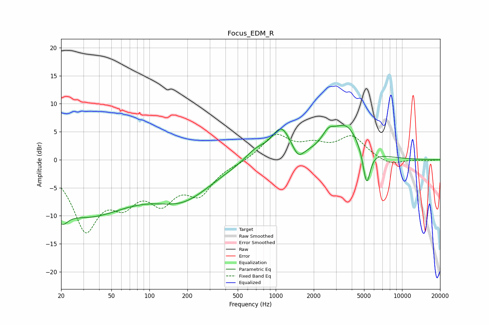

# Focus_EDM_R
See [usage instructions](https://github.com/jaakkopasanen/AutoEq#usage) for more options and info.

### Parametric EQs
Apply preamp of -6.2 dB when using parametric equalizer.

|   # | Type    |   Fc (Hz) |    Q |   Gain (dB) |
|-----|---------|-----------|------|-------------|
|   1 | Peaking |        20 | 4.9  |       -10.8 |
|   2 | Peaking |        20 | 6    |         8   |
|   3 | Peaking |        31 | 0.37 |        -9.5 |
|   4 | Peaking |       187 | 0.61 |        -5.8 |
|   5 | Peaking |       696 | 1.56 |         2   |
|   6 | Peaking |      1108 | 1.87 |         5.4 |
|   7 | Peaking |      1504 | 3.16 |        -2.2 |
|   8 | Peaking |      2606 | 2.78 |         2.3 |
|   9 | Peaking |      3609 | 1.28 |         5.8 |
|  10 | Peaking |      5242 | 4.75 |        -6.7 |

### Fixed Band EQs
When using fixed band (also called graphic) equalizer, apply preamp of **-4.6 dB** (if available) and set gains manually with these parameters.

|   # | Type    |   Fc (Hz) |    Q |   Gain (dB) |
|-----|---------|-----------|------|-------------|
|   1 | Peaking |        31 | 1.41 |       -11.7 |
|   2 | Peaking |        62 | 1.41 |        -5.6 |
|   3 | Peaking |       125 | 1.41 |        -6.1 |
|   4 | Peaking |       250 | 1.41 |        -5.3 |
|   5 | Peaking |       500 | 1.41 |        -0.4 |
|   6 | Peaking |      1000 | 1.41 |         4.3 |
|   7 | Peaking |      2000 | 1.41 |         2.1 |
|   8 | Peaking |      4000 | 1.41 |         3.9 |
|   9 | Peaking |      8000 | 1.41 |        -1.1 |
|  10 | Peaking |     16000 | 1.41 |        -0.2 |

### Graphs

