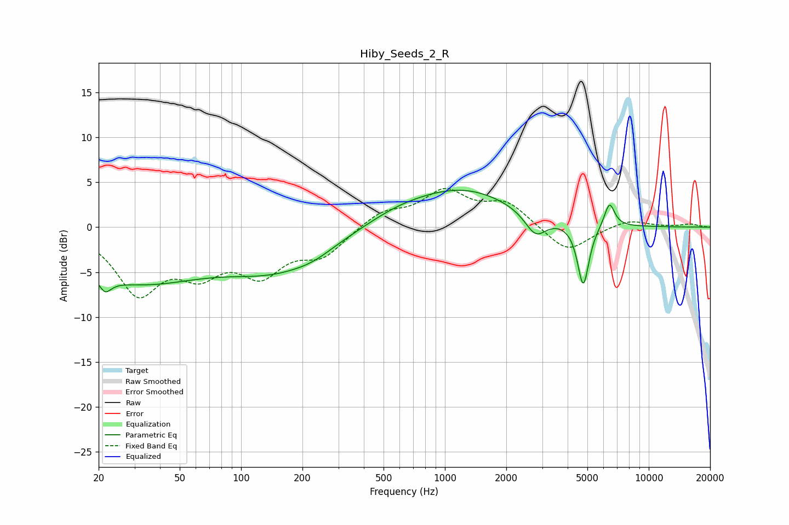

# Hiby_Seeds_2_R
See [usage instructions](https://github.com/jaakkopasanen/AutoEq#usage) for more options and info.

### Parametric EQs
Apply preamp of -4.2 dB when using parametric equalizer.

|   # | Type    |   Fc (Hz) |    Q |   Gain (dB) |
|-----|---------|-----------|------|-------------|
|   1 | Peaking |        22 | 5.43 |        -4.8 |
|   2 | Peaking |        22 | 5.82 |         3.3 |
|   3 | Peaking |        30 | 0.4  |        -5.8 |
|   4 | Peaking |       151 | 0.57 |        -3.9 |
|   5 | Peaking |       227 | 1.52 |        -0.6 |
|   6 | Peaking |       584 | 0.9  |         0.9 |
|   7 | Peaking |      1221 | 0.55 |         4.1 |
|   8 | Peaking |      2785 | 2.67 |        -2.5 |
|   9 | Peaking |      4773 | 4.94 |        -7   |
|  10 | Peaking |      6417 | 5.38 |         2.8 |

### Fixed Band EQs
When using fixed band (also called graphic) equalizer, apply preamp of **-4.4 dB** (if available) and set gains manually with these parameters.

|   # | Type    |   Fc (Hz) |    Q |   Gain (dB) |
|-----|---------|-----------|------|-------------|
|   1 | Peaking |        31 | 1.41 |        -6.9 |
|   2 | Peaking |        62 | 1.41 |        -4.1 |
|   3 | Peaking |       125 | 1.41 |        -4.5 |
|   4 | Peaking |       250 | 1.41 |        -2.9 |
|   5 | Peaking |       500 | 1.41 |         1.7 |
|   6 | Peaking |      1000 | 1.41 |         3.8 |
|   7 | Peaking |      2000 | 1.41 |         2.6 |
|   8 | Peaking |      4000 | 1.41 |        -2.9 |
|   9 | Peaking |      8000 | 1.41 |         0.9 |
|  10 | Peaking |     16000 | 1.41 |         0.3 |

### Graphs

