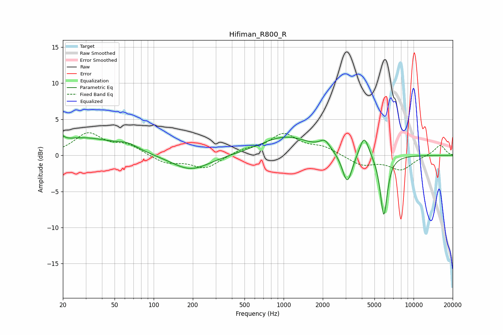

# Hifiman_R800_R
See [usage instructions](https://github.com/jaakkopasanen/AutoEq#usage) for more options and info.

### Parametric EQs
Apply preamp of -2.8 dB when using parametric equalizer.

|   # | Type    |   Fc (Hz) |    Q |   Gain (dB) |
|-----|---------|-----------|------|-------------|
|   1 | Peaking |        20 | 5.95 |         2.5 |
|   2 | Peaking |        20 | 5.98 |        -1.8 |
|   3 | Peaking |        29 | 0.55 |         2.4 |
|   4 | Peaking |        63 | 1.81 |         0.8 |
|   5 | Peaking |       193 | 0.96 |        -2.2 |
|   6 | Peaking |      1037 | 0.74 |         2.6 |
|   7 | Peaking |      2076 | 3.55 |         1.3 |
|   8 | Peaking |      3088 | 3.73 |        -4.3 |
|   9 | Peaking |      4166 | 3.94 |         3.1 |
|  10 | Peaking |      5900 | 5.09 |        -8.5 |

### Fixed Band EQs
When using fixed band (also called graphic) equalizer, apply preamp of **-3.2 dB** (if available) and set gains manually with these parameters.

|   # | Type    |   Fc (Hz) |    Q |   Gain (dB) |
|-----|---------|-----------|------|-------------|
|   1 | Peaking |        31 | 1.41 |         2.9 |
|   2 | Peaking |        62 | 1.41 |         1.3 |
|   3 | Peaking |       125 | 1.41 |        -1.1 |
|   4 | Peaking |       250 | 1.41 |        -1.8 |
|   5 | Peaking |       500 | 1.41 |         0.7 |
|   6 | Peaking |      1000 | 1.41 |         2.8 |
|   7 | Peaking |      2000 | 1.41 |         1.1 |
|   8 | Peaking |      4000 | 1.41 |        -1.3 |
|   9 | Peaking |      8000 | 1.41 |        -1.9 |
|  10 | Peaking |     16000 | 1.41 |         1.5 |

### Graphs

