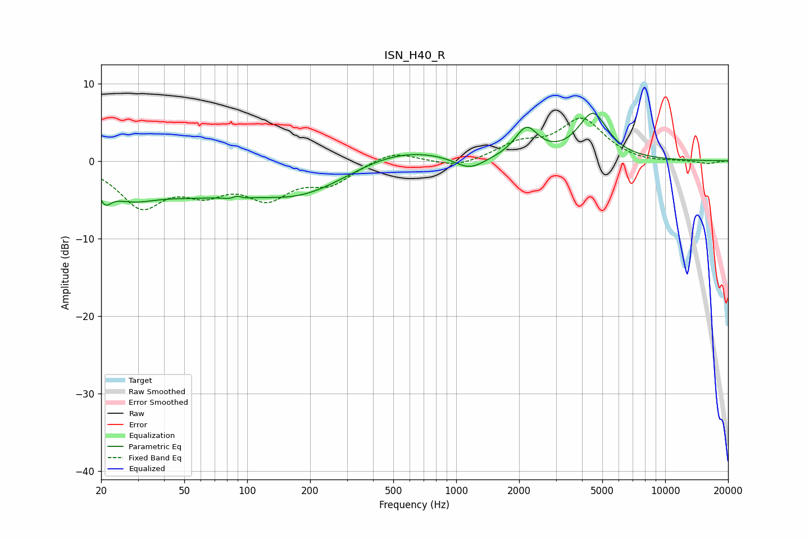

# ISN_H40_R
See [usage instructions](https://github.com/jaakkopasanen/AutoEq#usage) for more options and info.

### Parametric EQs
Apply preamp of -6.2 dB when using parametric equalizer.

|   # | Type    |   Fc (Hz) |    Q |   Gain (dB) |
|-----|---------|-----------|------|-------------|
|   1 | Peaking |        21 | 5.2  |        -1.8 |
|   2 | Peaking |        27 | 0.93 |        -3.8 |
|   3 | Peaking |        55 | 0.79 |        -2.2 |
|   4 | Peaking |        89 | 4.2  |        -4   |
|   5 | Peaking |        89 | 4.79 |         4   |
|   6 | Peaking |       176 | 0.54 |        -4.7 |
|   7 | Peaking |       505 | 0.59 |         2.3 |
|   8 | Peaking |      1159 | 1.9  |        -1.8 |
|   9 | Peaking |      2170 | 2.58 |         3.8 |
|  10 | Peaking |      4513 | 1.97 |         5.9 |

### Fixed Band EQs
When using fixed band (also called graphic) equalizer, apply preamp of **-5.6 dB** (if available) and set gains manually with these parameters.

|   # | Type    |   Fc (Hz) |    Q |   Gain (dB) |
|-----|---------|-----------|------|-------------|
|   1 | Peaking |        31 | 1.41 |        -5.5 |
|   2 | Peaking |        62 | 1.41 |        -3.2 |
|   3 | Peaking |       125 | 1.41 |        -4.2 |
|   4 | Peaking |       250 | 1.41 |        -2.6 |
|   5 | Peaking |       500 | 1.41 |         1.4 |
|   6 | Peaking |      1000 | 1.41 |        -0.9 |
|   7 | Peaking |      2000 | 1.41 |         2   |
|   8 | Peaking |      4000 | 1.41 |         5.2 |
|   9 | Peaking |      8000 | 1.41 |        -0.3 |
|  10 | Peaking |     16000 | 1.41 |        -0.4 |

### Graphs

