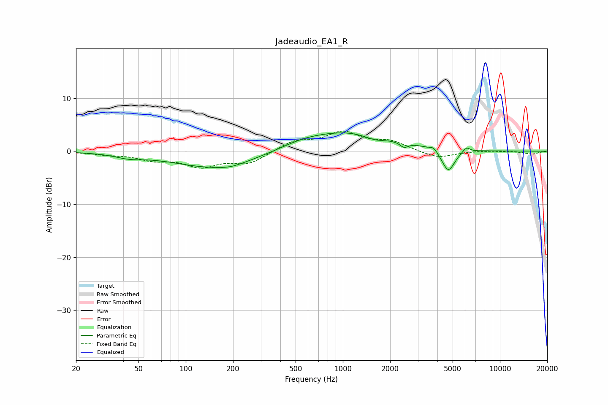

# Jadeaudio_EA1_R
See [usage instructions](https://github.com/jaakkopasanen/AutoEq#usage) for more options and info.

### Parametric EQs
Apply preamp of -3.6 dB when using parametric equalizer.

|   # | Type    |   Fc (Hz) |    Q |   Gain (dB) |
|-----|---------|-----------|------|-------------|
|   1 | Peaking |        44 | 1.61 |        -0.7 |
|   2 | Peaking |       155 | 0.52 |        -3.1 |
|   3 | Peaking |       193 | 1.82 |        -0.4 |
|   4 | Peaking |       549 | 1.1  |         0.7 |
|   5 | Peaking |      1126 | 0.49 |         3.8 |
|   6 | Peaking |      1602 | 1.77 |        -1.1 |
|   7 | Peaking |      2454 | 5.34 |        -1   |
|   8 | Peaking |      3781 | 5.93 |         0.8 |
|   9 | Peaking |      4691 | 3.36 |        -4.3 |
|  10 | Peaking |      6107 | 6    |         1   |

### Fixed Band EQs
When using fixed band (also called graphic) equalizer, apply preamp of **-3.9 dB** (if available) and set gains manually with these parameters.

|   # | Type    |   Fc (Hz) |    Q |   Gain (dB) |
|-----|---------|-----------|------|-------------|
|   1 | Peaking |        31 | 1.41 |        -0.5 |
|   2 | Peaking |        62 | 1.41 |        -1.4 |
|   3 | Peaking |       125 | 1.41 |        -2.6 |
|   4 | Peaking |       250 | 1.41 |        -2.2 |
|   5 | Peaking |       500 | 1.41 |         1.9 |
|   6 | Peaking |      1000 | 1.41 |         3.3 |
|   7 | Peaking |      2000 | 1.41 |         1.7 |
|   8 | Peaking |      4000 | 1.41 |        -1.4 |
|   9 | Peaking |      8000 | 1.41 |         0.1 |
|  10 | Peaking |     16000 | 1.41 |        -0.6 |

### Graphs

