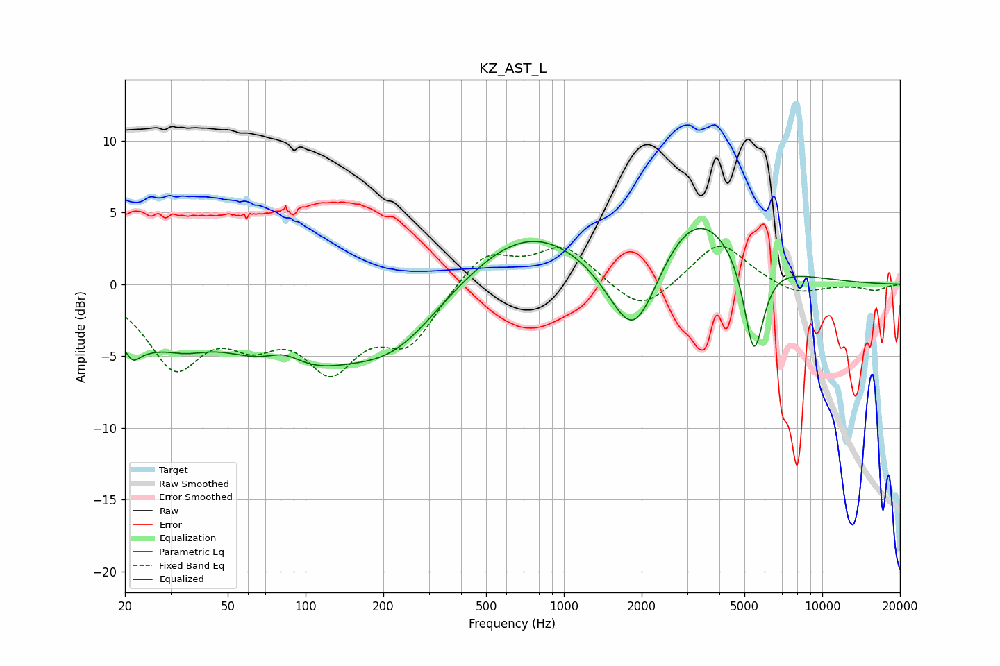

# KZ_AST_L
See [usage instructions](https://github.com/jaakkopasanen/AutoEq#usage) for more options and info.

### Parametric EQs
Apply preamp of -4.0 dB when using parametric equalizer.

|   # | Type    |   Fc (Hz) |    Q |   Gain (dB) |
|-----|---------|-----------|------|-------------|
|   1 | Peaking |        21 | 1.34 |        -2.9 |
|   2 | Peaking |        21 | 5.96 |        -0.8 |
|   3 | Peaking |        34 | 1.45 |        -1.4 |
|   4 | Peaking |        83 | 1.9  |         1.3 |
|   5 | Peaking |        86 | 0.55 |        -5.4 |
|   6 | Peaking |       224 | 0.8  |        -3.3 |
|   7 | Peaking |       730 | 0.59 |         4   |
|   8 | Peaking |      1868 | 1.39 |        -6.8 |
|   9 | Peaking |      3205 | 0.79 |         5.6 |
|  10 | Peaking |      5438 | 3.58 |        -7   |

### Fixed Band EQs
When using fixed band (also called graphic) equalizer, apply preamp of **-2.7 dB** (if available) and set gains manually with these parameters.

|   # | Type    |   Fc (Hz) |    Q |   Gain (dB) |
|-----|---------|-----------|------|-------------|
|   1 | Peaking |        31 | 1.41 |        -5.3 |
|   2 | Peaking |        62 | 1.41 |        -2.9 |
|   3 | Peaking |       125 | 1.41 |        -5.1 |
|   4 | Peaking |       250 | 1.41 |        -3.7 |
|   5 | Peaking |       500 | 1.41 |         2.4 |
|   6 | Peaking |      1000 | 1.41 |         2.6 |
|   7 | Peaking |      2000 | 1.41 |        -2.1 |
|   8 | Peaking |      4000 | 1.41 |         3   |
|   9 | Peaking |      8000 | 1.41 |        -0.8 |
|  10 | Peaking |     16000 | 1.41 |        -0.4 |

### Graphs

