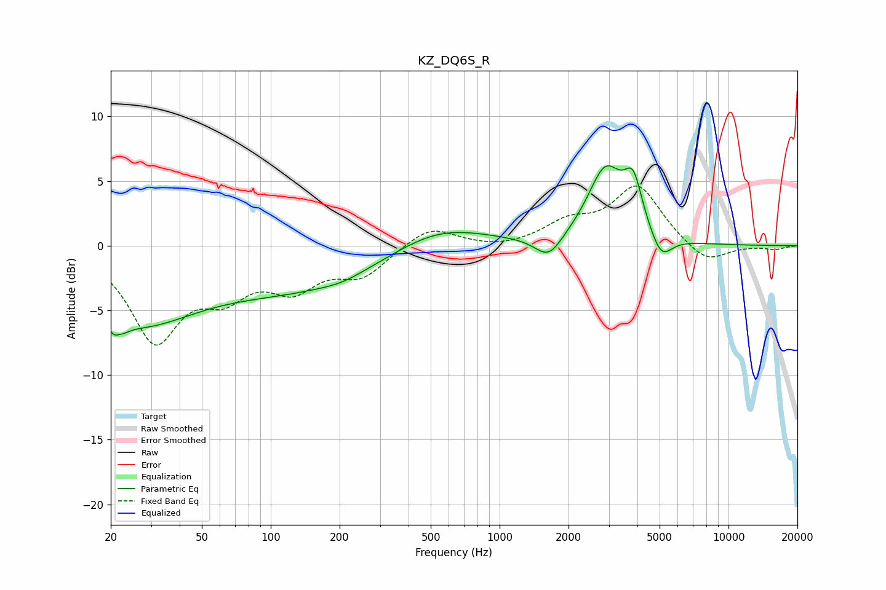

# KZ_DQ6S_R
See [usage instructions](https://github.com/jaakkopasanen/AutoEq#usage) for more options and info.

### Parametric EQs
Apply preamp of -6.3 dB when using parametric equalizer.

|   # | Type    |   Fc (Hz) |    Q |   Gain (dB) |
|-----|---------|-----------|------|-------------|
|   1 | Peaking |        21 | 5.14 |        -4.4 |
|   2 | Peaking |        21 | 6    |         3.2 |
|   3 | Peaking |        26 | 0.54 |        -5.4 |
|   4 | Peaking |       138 | 0.38 |        -3.1 |
|   5 | Peaking |       205 | 1.66 |        -0.3 |
|   6 | Peaking |       531 | 0.66 |         2   |
|   7 | Peaking |      1639 | 2.36 |        -1.8 |
|   8 | Peaking |      2901 | 1.8  |         5.7 |
|   9 | Peaking |      3837 | 3.58 |         3.6 |
|  10 | Peaking |      5085 | 3.05 |        -1.9 |

### Fixed Band EQs
When using fixed band (also called graphic) equalizer, apply preamp of **-4.7 dB** (if available) and set gains manually with these parameters.

|   # | Type    |   Fc (Hz) |    Q |   Gain (dB) |
|-----|---------|-----------|------|-------------|
|   1 | Peaking |        31 | 1.41 |        -7   |
|   2 | Peaking |        62 | 1.41 |        -3   |
|   3 | Peaking |       125 | 1.41 |        -2.8 |
|   4 | Peaking |       250 | 1.41 |        -2.1 |
|   5 | Peaking |       500 | 1.41 |         1.6 |
|   6 | Peaking |      1000 | 1.41 |        -0.3 |
|   7 | Peaking |      2000 | 1.41 |         1.6 |
|   8 | Peaking |      4000 | 1.41 |         4.6 |
|   9 | Peaking |      8000 | 1.41 |        -1.5 |
|  10 | Peaking |     16000 | 1.41 |        -0.3 |

### Graphs

