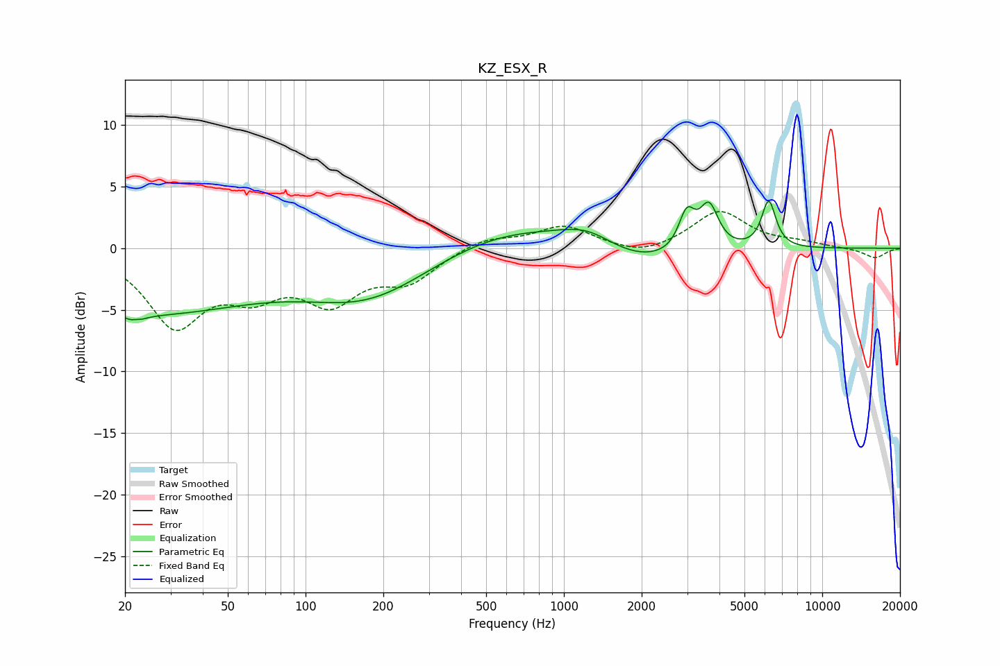

# KZ_ESX_R
See [usage instructions](https://github.com/jaakkopasanen/AutoEq#usage) for more options and info.

### Parametric EQs
Apply preamp of -3.9 dB when using parametric equalizer.

|   # | Type    |   Fc (Hz) |    Q |   Gain (dB) |
|-----|---------|-----------|------|-------------|
|   1 | Peaking |        22 | 5.49 |        -3.6 |
|   2 | Peaking |        22 | 5.93 |         3.2 |
|   3 | Peaking |        22 | 0.3  |        -5.2 |
|   4 | Peaking |       176 | 0.58 |        -3.8 |
|   5 | Peaking |       617 | 0.52 |         1.9 |
|   6 | Peaking |      1236 | 1.26 |         1.6 |
|   7 | Peaking |      1908 | 0.69 |        -1.7 |
|   8 | Peaking |      2991 | 4.5  |         3   |
|   9 | Peaking |      3646 | 3.88 |         3.5 |
|  10 | Peaking |      6206 | 5.05 |         3.8 |

### Fixed Band EQs
When using fixed band (also called graphic) equalizer, apply preamp of **-3.1 dB** (if available) and set gains manually with these parameters.

|   # | Type    |   Fc (Hz) |    Q |   Gain (dB) |
|-----|---------|-----------|------|-------------|
|   1 | Peaking |        31 | 1.41 |        -6   |
|   2 | Peaking |        62 | 1.41 |        -2.9 |
|   3 | Peaking |       125 | 1.41 |        -3.8 |
|   4 | Peaking |       250 | 1.41 |        -2.4 |
|   5 | Peaking |       500 | 1.41 |         0.9 |
|   6 | Peaking |      1000 | 1.41 |         1.8 |
|   7 | Peaking |      2000 | 1.41 |        -0.8 |
|   8 | Peaking |      4000 | 1.41 |         3   |
|   9 | Peaking |      8000 | 1.41 |         0.4 |
|  10 | Peaking |     16000 | 1.41 |        -0.8 |

### Graphs

