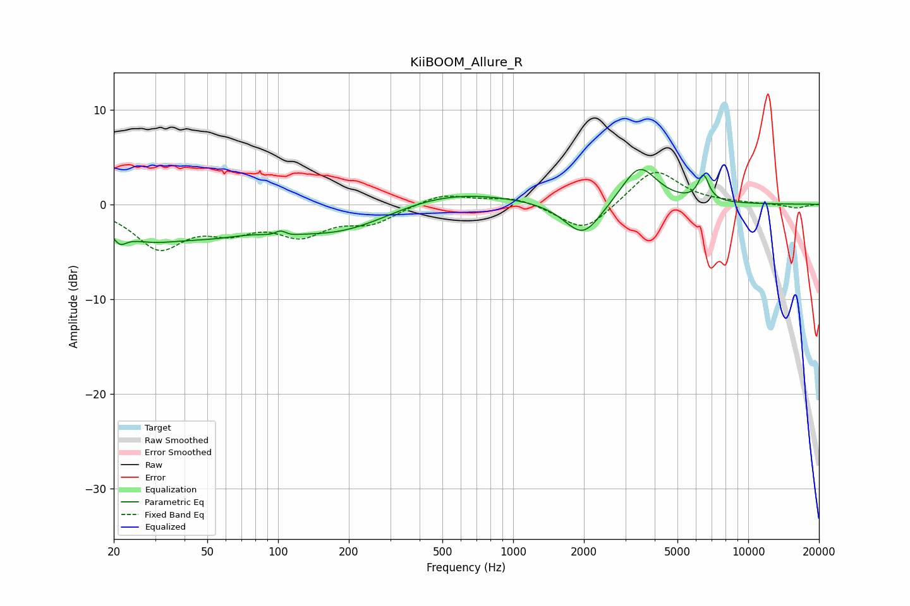

# KiiBOOM_Allure_R
See [usage instructions](https://github.com/jaakkopasanen/AutoEq#usage) for more options and info.

### Parametric EQs
Apply preamp of -3.8 dB when using parametric equalizer.

|   # | Type    |   Fc (Hz) |    Q |   Gain (dB) |
|-----|---------|-----------|------|-------------|
|   1 | Peaking |        21 | 4.88 |        -1.4 |
|   2 | Peaking |        27 | 0.94 |        -2.6 |
|   3 | Peaking |        52 | 0.76 |        -2   |
|   4 | Peaking |       103 | 4.46 |         3   |
|   5 | Peaking |       103 | 3.76 |        -2.8 |
|   6 | Peaking |       187 | 0.56 |        -3.3 |
|   7 | Peaking |       470 | 0.5  |         2   |
|   8 | Peaking |      1981 | 1.8  |        -3.7 |
|   9 | Peaking |      3442 | 1.88 |         4.2 |
|  10 | Peaking |      6448 | 5.93 |         2.7 |

### Fixed Band EQs
When using fixed band (also called graphic) equalizer, apply preamp of **-3.4 dB** (if available) and set gains manually with these parameters.

|   # | Type    |   Fc (Hz) |    Q |   Gain (dB) |
|-----|---------|-----------|------|-------------|
|   1 | Peaking |        31 | 1.41 |        -4.4 |
|   2 | Peaking |        62 | 1.41 |        -2.2 |
|   3 | Peaking |       125 | 1.41 |        -2.8 |
|   4 | Peaking |       250 | 1.41 |        -1.8 |
|   5 | Peaking |       500 | 1.41 |         1.2 |
|   6 | Peaking |      1000 | 1.41 |         0.8 |
|   7 | Peaking |      2000 | 1.41 |        -3   |
|   8 | Peaking |      4000 | 1.41 |         3.8 |
|   9 | Peaking |      8000 | 1.41 |         0.1 |
|  10 | Peaking |     16000 | 1.41 |        -0.4 |

### Graphs

