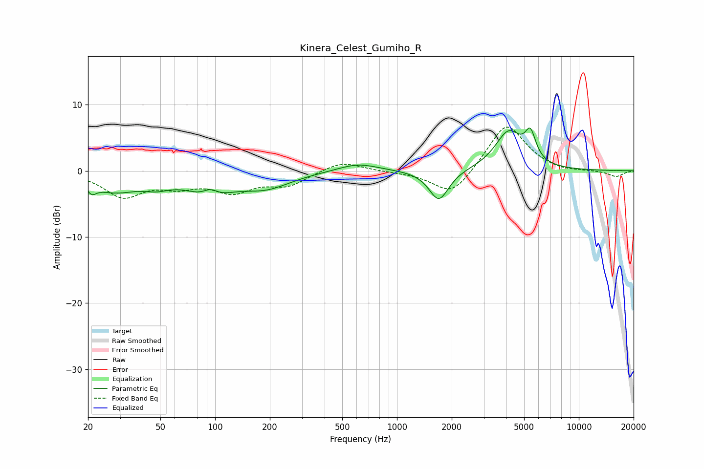

# Kinera_Celest_Gumiho_R
See [usage instructions](https://github.com/jaakkopasanen/AutoEq#usage) for more options and info.

### Parametric EQs
Apply preamp of -6.6 dB when using parametric equalizer.

|   # | Type    |   Fc (Hz) |    Q |   Gain (dB) |
|-----|---------|-----------|------|-------------|
|   1 | Peaking |        21 | 5.59 |        -1.3 |
|   2 | Peaking |        28 | 1.07 |        -2.8 |
|   3 | Peaking |        48 | 1.85 |        -1.2 |
|   4 | Peaking |        93 | 1.24 |        -3.3 |
|   5 | Peaking |        94 | 3.33 |         1.4 |
|   6 | Peaking |       191 | 1.02 |        -2.3 |
|   7 | Peaking |       609 | 1.29 |         1.2 |
|   8 | Peaking |      1699 | 2.61 |        -4.7 |
|   9 | Peaking |      4111 | 1.89 |         5.8 |
|  10 | Peaking |      5416 | 4.74 |         4   |

### Fixed Band EQs
When using fixed band (also called graphic) equalizer, apply preamp of **-6.7 dB** (if available) and set gains manually with these parameters.

|   # | Type    |   Fc (Hz) |    Q |   Gain (dB) |
|-----|---------|-----------|------|-------------|
|   1 | Peaking |        31 | 1.41 |        -3.7 |
|   2 | Peaking |        62 | 1.41 |        -1.9 |
|   3 | Peaking |       125 | 1.41 |        -2.8 |
|   4 | Peaking |       250 | 1.41 |        -2   |
|   5 | Peaking |       500 | 1.41 |         1.5 |
|   6 | Peaking |      1000 | 1.41 |        -0.1 |
|   7 | Peaking |      2000 | 1.41 |        -4   |
|   8 | Peaking |      4000 | 1.41 |         7.3 |
|   9 | Peaking |      8000 | 1.41 |        -0.3 |
|  10 | Peaking |     16000 | 1.41 |        -0.9 |

### Graphs

