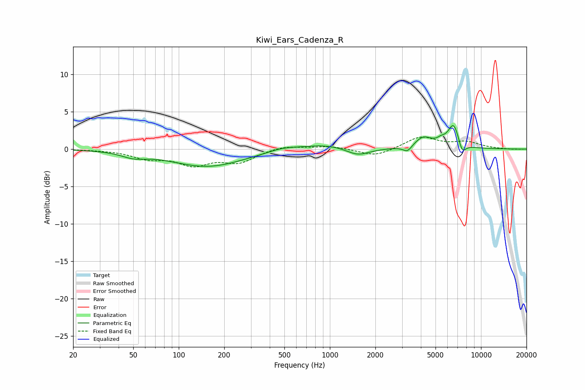

# Kiwi_Ears_Cadenza_R
See [usage instructions](https://github.com/jaakkopasanen/AutoEq#usage) for more options and info.

### Parametric EQs
Apply preamp of -3.2 dB when using parametric equalizer.

|   # | Type    |   Fc (Hz) |    Q |   Gain (dB) |
|-----|---------|-----------|------|-------------|
|   1 | Peaking |        50 | 1.82 |        -0.7 |
|   2 | Peaking |       155 | 0.59 |        -2.3 |
|   3 | Peaking |       483 | 1.5  |         0.4 |
|   4 | Peaking |       945 | 0.83 |         0.7 |
|   5 | Peaking |      1526 | 1.76 |        -1.1 |
|   6 | Peaking |      3265 | 4.79 |        -0.9 |
|   7 | Peaking |      4146 | 2.33 |         1.5 |
|   8 | Peaking |      5444 | 5.21 |         0.5 |
|   9 | Peaking |      6595 | 3.6  |         3.3 |
|  10 | Peaking |      7494 | 5.31 |        -1.6 |

### Fixed Band EQs
When using fixed band (also called graphic) equalizer, apply preamp of **-1.7 dB** (if available) and set gains manually with these parameters.

|   # | Type    |   Fc (Hz) |    Q |   Gain (dB) |
|-----|---------|-----------|------|-------------|
|   1 | Peaking |        31 | 1.41 |        -0.1 |
|   2 | Peaking |        62 | 1.41 |        -1.1 |
|   3 | Peaking |       125 | 1.41 |        -1.9 |
|   4 | Peaking |       250 | 1.41 |        -1.6 |
|   5 | Peaking |       500 | 1.41 |         0.5 |
|   6 | Peaking |      1000 | 1.41 |         0.4 |
|   7 | Peaking |      2000 | 1.41 |        -1   |
|   8 | Peaking |      4000 | 1.41 |         1.6 |
|   9 | Peaking |      8000 | 1.41 |         0.8 |
|  10 | Peaking |     16000 | 1.41 |        -0.1 |

### Graphs

