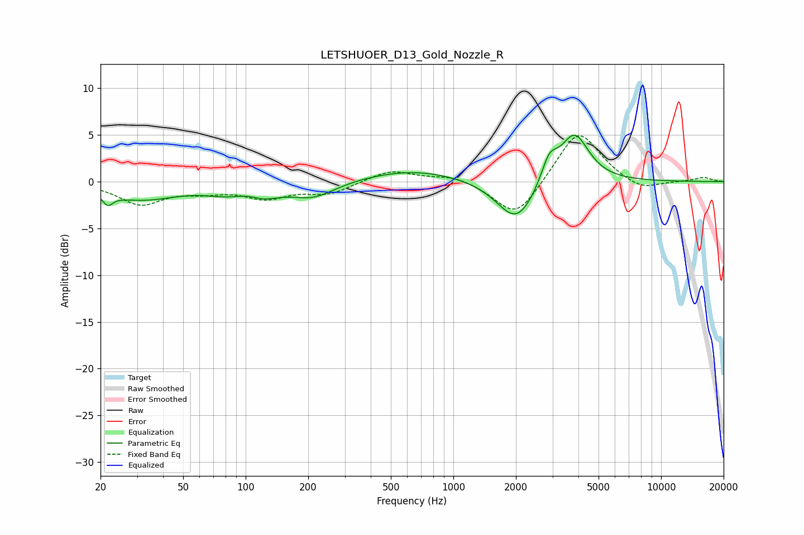

# LETSHUOER_D13_Gold_Nozzle_R
See [usage instructions](https://github.com/jaakkopasanen/AutoEq#usage) for more options and info.

### Parametric EQs
Apply preamp of -5.1 dB when using parametric equalizer.

|   # | Type    |   Fc (Hz) |    Q |   Gain (dB) |
|-----|---------|-----------|------|-------------|
|   1 | Peaking |        22 | 5.96 |        -1.1 |
|   2 | Peaking |        31 | 0.76 |        -1.8 |
|   3 | Peaking |        80 | 1.43 |        -0.9 |
|   4 | Peaking |       128 | 2.78 |        -1.9 |
|   5 | Peaking |       129 | 3.45 |         1   |
|   6 | Peaking |       209 | 1.26 |        -1.8 |
|   7 | Peaking |       641 | 0.59 |         1.3 |
|   8 | Peaking |      2015 | 1.5  |        -4.6 |
|   9 | Peaking |      2895 | 3.64 |         2.6 |
|  10 | Peaking |      3824 | 2.01 |         5.3 |

### Fixed Band EQs
When using fixed band (also called graphic) equalizer, apply preamp of **-5.0 dB** (if available) and set gains manually with these parameters.

|   # | Type    |   Fc (Hz) |    Q |   Gain (dB) |
|-----|---------|-----------|------|-------------|
|   1 | Peaking |        31 | 1.41 |        -2.3 |
|   2 | Peaking |        62 | 1.41 |        -0.8 |
|   3 | Peaking |       125 | 1.41 |        -1.6 |
|   4 | Peaking |       250 | 1.41 |        -1.2 |
|   5 | Peaking |       500 | 1.41 |         1.3 |
|   6 | Peaking |      1000 | 1.41 |         0.7 |
|   7 | Peaking |      2000 | 1.41 |        -4.1 |
|   8 | Peaking |      4000 | 1.41 |         5.7 |
|   9 | Peaking |      8000 | 1.41 |        -1.1 |
|  10 | Peaking |     16000 | 1.41 |         0.4 |

### Graphs

