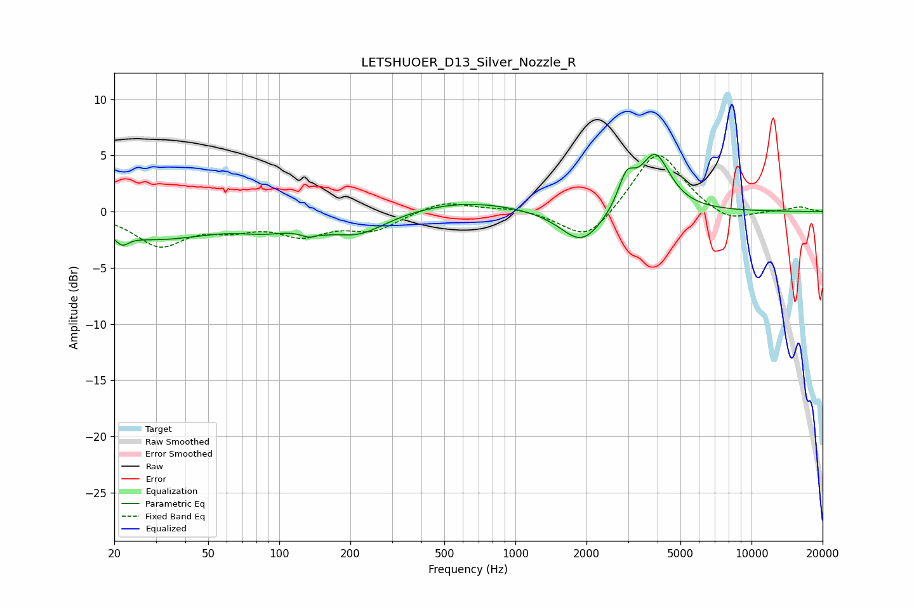

# LETSHUOER_D13_Silver_Nozzle_R
See [usage instructions](https://github.com/jaakkopasanen/AutoEq#usage) for more options and info.

### Parametric EQs
Apply preamp of -5.2 dB when using parametric equalizer.

|   # | Type    |   Fc (Hz) |    Q |   Gain (dB) |
|-----|---------|-----------|------|-------------|
|   1 | Peaking |        22 | 5.32 |        -0.9 |
|   2 | Peaking |        30 | 0.55 |        -2.3 |
|   3 | Peaking |        88 | 1.22 |        -0.9 |
|   4 | Peaking |       140 | 3.54 |        -2.1 |
|   5 | Peaking |       142 | 4.36 |         1.4 |
|   6 | Peaking |       215 | 1.19 |        -1.9 |
|   7 | Peaking |       615 | 0.63 |         1   |
|   8 | Peaking |      1911 | 1.59 |        -3.1 |
|   9 | Peaking |      2955 | 4.03 |         2.6 |
|  10 | Peaking |      3904 | 2.2  |         5   |

### Fixed Band EQs
When using fixed band (also called graphic) equalizer, apply preamp of **-5.1 dB** (if available) and set gains manually with these parameters.

|   # | Type    |   Fc (Hz) |    Q |   Gain (dB) |
|-----|---------|-----------|------|-------------|
|   1 | Peaking |        31 | 1.41 |        -2.9 |
|   2 | Peaking |        62 | 1.41 |        -1.2 |
|   3 | Peaking |       125 | 1.41 |        -1.8 |
|   4 | Peaking |       250 | 1.41 |        -1.5 |
|   5 | Peaking |       500 | 1.41 |         1   |
|   6 | Peaking |      1000 | 1.41 |         0.3 |
|   7 | Peaking |      2000 | 1.41 |        -2.8 |
|   8 | Peaking |      4000 | 1.41 |         5.6 |
|   9 | Peaking |      8000 | 1.41 |        -1.1 |
|  10 | Peaking |     16000 | 1.41 |         0.4 |

### Graphs

