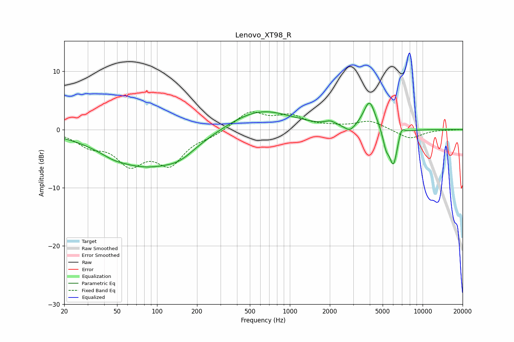

# Lenovo_XT98_R
See [usage instructions](https://github.com/jaakkopasanen/AutoEq#usage) for more options and info.

### Parametric EQs
Apply preamp of -4.6 dB when using parametric equalizer.

|   # | Type    |   Fc (Hz) |    Q |   Gain (dB) |
|-----|---------|-----------|------|-------------|
|   1 | Peaking |        47 | 1.81 |        -0.5 |
|   2 | Peaking |        82 | 0.46 |        -6.2 |
|   3 | Peaking |       149 | 1.31 |        -1.4 |
|   4 | Peaking |       595 | 0.59 |         3.6 |
|   5 | Peaking |      2023 | 3.69 |         0.7 |
|   6 | Peaking |      2835 | 3.77 |        -1.2 |
|   7 | Peaking |      3983 | 3.12 |         5   |
|   8 | Peaking |      5301 | 5.91 |        -2.5 |
|   9 | Peaking |      6024 | 4.43 |        -6.2 |
|  10 | Peaking |      6932 | 5.92 |         1.6 |

### Fixed Band EQs
When using fixed band (also called graphic) equalizer, apply preamp of **-3.1 dB** (if available) and set gains manually with these parameters.

|   # | Type    |   Fc (Hz) |    Q |   Gain (dB) |
|-----|---------|-----------|------|-------------|
|   1 | Peaking |        31 | 1.41 |        -2.3 |
|   2 | Peaking |        62 | 1.41 |        -5.2 |
|   3 | Peaking |       125 | 1.41 |        -5.4 |
|   4 | Peaking |       250 | 1.41 |        -0.8 |
|   5 | Peaking |       500 | 1.41 |         3   |
|   6 | Peaking |      1000 | 1.41 |         2.1 |
|   7 | Peaking |      2000 | 1.41 |         0.4 |
|   8 | Peaking |      4000 | 1.41 |         1.5 |
|   9 | Peaking |      8000 | 1.41 |        -1.6 |
|  10 | Peaking |     16000 | 1.41 |        -0   |

### Graphs

