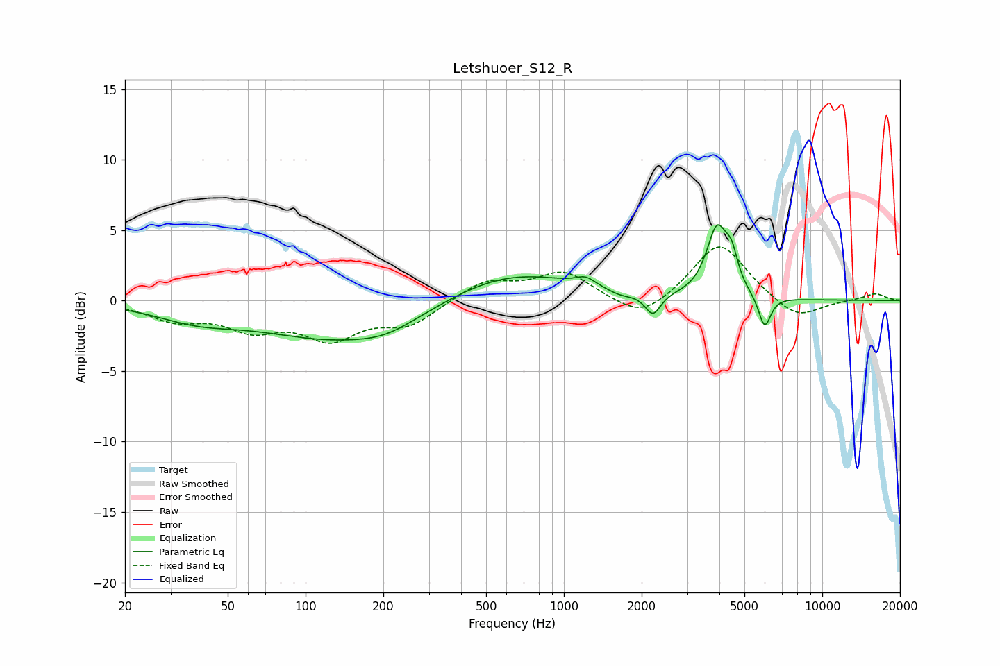

# Letshuoer_S12_R
See [usage instructions](https://github.com/jaakkopasanen/AutoEq#usage) for more options and info.

### Parametric EQs
Apply preamp of -5.5 dB when using parametric equalizer.

|   # | Type    |   Fc (Hz) |    Q |   Gain (dB) |
|-----|---------|-----------|------|-------------|
|   1 | Peaking |        38 | 0.9  |        -1   |
|   2 | Peaking |       148 | 0.43 |        -2.9 |
|   3 | Peaking |       205 | 1.37 |        -0.5 |
|   4 | Peaking |       585 | 0.52 |         2.4 |
|   5 | Peaking |      1215 | 3.85 |         0.6 |
|   6 | Peaking |      1660 | 2.84 |        -0.4 |
|   7 | Peaking |      2211 | 4.69 |        -1.6 |
|   8 | Peaking |      3920 | 3.47 |         4.8 |
|   9 | Peaking |      4465 | 6    |         1.8 |
|  10 | Peaking |      5987 | 5.88 |        -2.3 |

### Fixed Band EQs
When using fixed band (also called graphic) equalizer, apply preamp of **-3.9 dB** (if available) and set gains manually with these parameters.

|   # | Type    |   Fc (Hz) |    Q |   Gain (dB) |
|-----|---------|-----------|------|-------------|
|   1 | Peaking |        31 | 1.41 |        -1.2 |
|   2 | Peaking |        62 | 1.41 |        -1.7 |
|   3 | Peaking |       125 | 1.41 |        -2.4 |
|   4 | Peaking |       250 | 1.41 |        -1.6 |
|   5 | Peaking |       500 | 1.41 |         1.4 |
|   6 | Peaking |      1000 | 1.41 |         2   |
|   7 | Peaking |      2000 | 1.41 |        -1.6 |
|   8 | Peaking |      4000 | 1.41 |         4.2 |
|   9 | Peaking |      8000 | 1.41 |        -1.4 |
|  10 | Peaking |     16000 | 1.41 |         0.5 |

### Graphs

