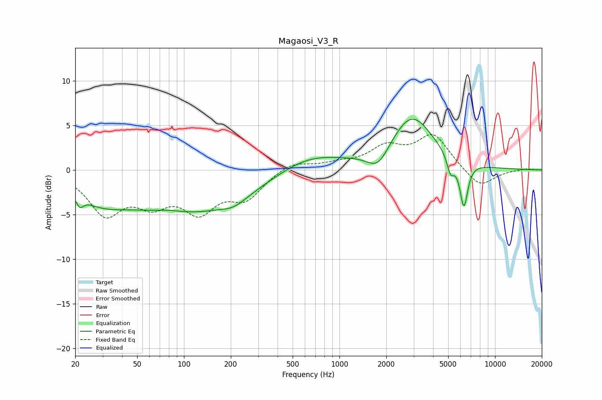

# Magaosi_V3_R
See [usage instructions](https://github.com/jaakkopasanen/AutoEq#usage) for more options and info.

### Parametric EQs
Apply preamp of -5.8 dB when using parametric equalizer.

|   # | Type    |   Fc (Hz) |    Q |   Gain (dB) |
|-----|---------|-----------|------|-------------|
|   1 | Peaking |        21 | 5.99 |        -1.2 |
|   2 | Peaking |        28 | 0.89 |        -2   |
|   3 | Peaking |        80 | 1.43 |         0.4 |
|   4 | Peaking |       106 | 0.33 |        -4.8 |
|   5 | Peaking |       210 | 1.87 |        -0.7 |
|   6 | Peaking |       629 | 0.65 |         2   |
|   7 | Peaking |      1772 | 2.03 |        -2.2 |
|   8 | Peaking |      2922 | 1.02 |         6   |
|   9 | Peaking |      5179 | 6    |        -2   |
|  10 | Peaking |      6307 | 5.4  |        -5.2 |

### Fixed Band EQs
When using fixed band (also called graphic) equalizer, apply preamp of **-4.1 dB** (if available) and set gains manually with these parameters.

|   # | Type    |   Fc (Hz) |    Q |   Gain (dB) |
|-----|---------|-----------|------|-------------|
|   1 | Peaking |        31 | 1.41 |        -4.6 |
|   2 | Peaking |        62 | 1.41 |        -3   |
|   3 | Peaking |       125 | 1.41 |        -4.1 |
|   4 | Peaking |       250 | 1.41 |        -2.9 |
|   5 | Peaking |       500 | 1.41 |         1   |
|   6 | Peaking |      1000 | 1.41 |         0.6 |
|   7 | Peaking |      2000 | 1.41 |         2.3 |
|   8 | Peaking |      4000 | 1.41 |         3.8 |
|   9 | Peaking |      8000 | 1.41 |        -2.1 |
|  10 | Peaking |     16000 | 1.41 |         0.2 |

### Graphs

