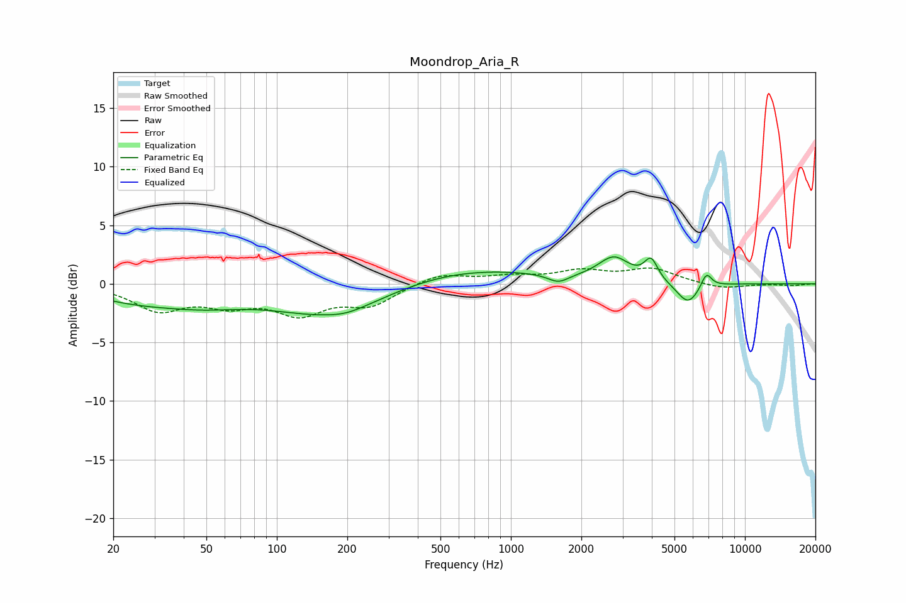

# Moondrop_Aria_R
See [usage instructions](https://github.com/jaakkopasanen/AutoEq#usage) for more options and info.

### Parametric EQs
Apply preamp of -2.4 dB when using parametric equalizer.

|   # | Type    |   Fc (Hz) |    Q |   Gain (dB) |
|-----|---------|-----------|------|-------------|
|   1 | Peaking |        25 | 0.73 |        -1.1 |
|   2 | Peaking |        48 | 0.77 |        -1.1 |
|   3 | Peaking |       177 | 0.55 |        -2.9 |
|   4 | Peaking |       198 | 2.02 |        -0.2 |
|   5 | Peaking |       562 | 0.39 |         1.5 |
|   6 | Peaking |      1596 | 3.17 |        -0.7 |
|   7 | Peaking |      2754 | 2.15 |         2   |
|   8 | Peaking |      3972 | 4.95 |         1.8 |
|   9 | Peaking |      5714 | 2.84 |        -1.9 |
|  10 | Peaking |      6841 | 6    |         1.3 |

### Fixed Band EQs
When using fixed band (also called graphic) equalizer, apply preamp of **-1.4 dB** (if available) and set gains manually with these parameters.

|   # | Type    |   Fc (Hz) |    Q |   Gain (dB) |
|-----|---------|-----------|------|-------------|
|   1 | Peaking |        31 | 1.41 |        -2.1 |
|   2 | Peaking |        62 | 1.41 |        -1.5 |
|   3 | Peaking |       125 | 1.41 |        -2.3 |
|   4 | Peaking |       250 | 1.41 |        -1.7 |
|   5 | Peaking |       500 | 1.41 |         0.9 |
|   6 | Peaking |      1000 | 1.41 |         0.5 |
|   7 | Peaking |      2000 | 1.41 |         1   |
|   8 | Peaking |      4000 | 1.41 |         1.2 |
|   9 | Peaking |      8000 | 1.41 |        -0.5 |
|  10 | Peaking |     16000 | 1.41 |        -0.1 |

### Graphs

